# RAGnarōk — Architecture Documentation

## Table of Contents

- [1. System Overview](#1-system-overview)
- [2. High-Level Architecture](#2-high-level-architecture)
- [3. Document Ingestion Pipeline](#3-document-ingestion-pipeline)
- [4. Query Execution Pipeline](#4-query-execution-pipeline)
- [5. Iterative Refinement & Gap Analysis](#5-iterative-refinement--gap-analysis)
- [6. Embedding Subsystem](#6-embedding-subsystem)
- [7. Retrieval Strategies](#7-retrieval-strategies)
- [8. Class Diagram](#8-class-diagram)
- [9. Sequence Diagrams](#9-sequence-diagrams)
- [10. Storage & Persistence](#10-storage--persistence)
- [11. Configuration Reference](#11-configuration-reference)
- [12. Commands Reference](#12-commands-reference)

---

## 1. System Overview

RAGnarōk is a VS Code extension that implements a full Retrieval-Augmented Generation (RAG) pipeline, exposing a Copilot-compatible language model tool for agentic query processing. It supports multiple embedding backends, retrieval strategies, iterative refinement with LLM-powered gap analysis, and per-topic vector stores backed by LanceDB.

### Core Capabilities

| Capability | Description |
|---|---|
| **Multi-format ingestion** | PDF, Markdown, HTML, plain text, GitHub repos, web pages |
| **Semantic chunking** | Structure-aware splitting with heading metadata preservation |
| **Dual embedding backends** | HuggingFace Transformers.js (local ONNX) or VS Code LM API |
| **4 retrieval strategies** | Vector, Hybrid, Ensemble (RRF), BM25 |
| **Agentic query planning** | LLM-powered query decomposition with heuristic fallback |
| **Iterative refinement** | Gap analysis → follow-up query generation → convergence detection |
| **Per-topic isolation** | Independent vector stores, document caches, and metadata per topic |

---

## 2. High-Level Architecture

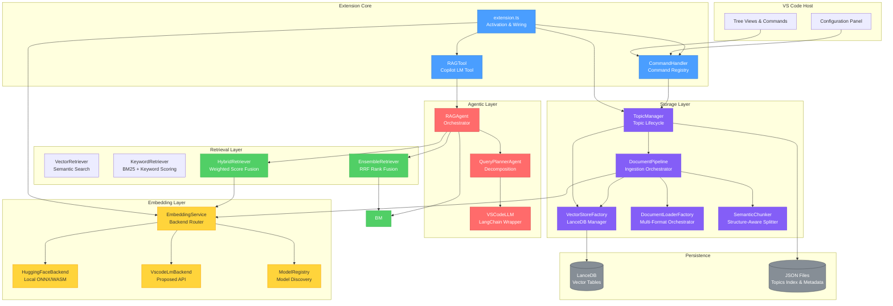

---

## 3. Document Ingestion Pipeline

The ingestion pipeline transforms raw files into searchable vector embeddings stored in LanceDB.

### Flow Diagram

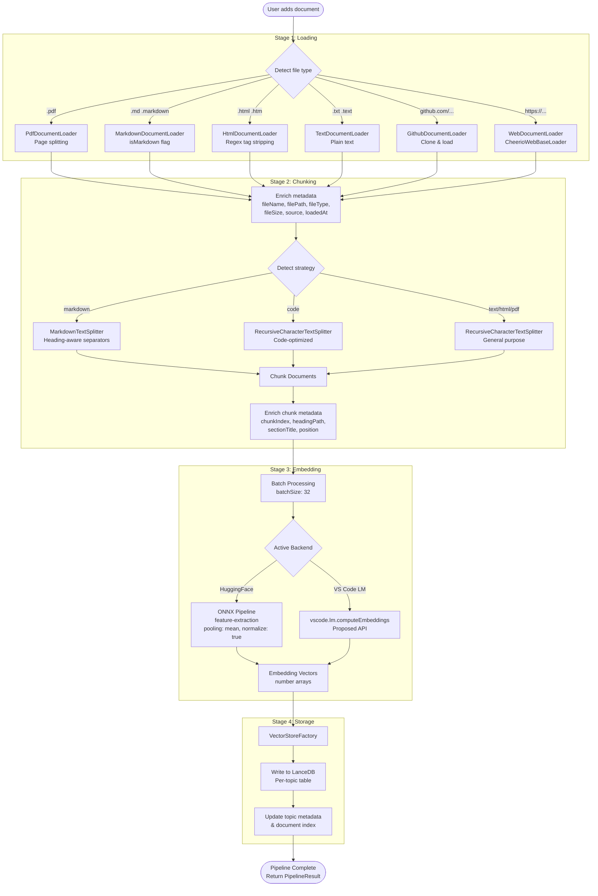

### Pipeline Result

Each pipeline execution returns a `PipelineResult` containing:

| Field | Description |
|---|---|
| `stages` | Boolean success per stage (loading, chunking, embedding, storing) |
| `metadata.originalDocuments` | Count of source documents loaded |
| `metadata.chunksCreated` | Total chunks after splitting |
| `metadata.chunksEmbedded` | Chunks successfully embedded |
| `metadata.chunksStored` | Chunks written to LanceDB |
| `metadata.stageTimings` | Per-stage timing breakdown |

### Loader Module Architecture

The document loading system uses a **modular architecture** with a shared `DocumentLoader` interface. `DocumentLoaderFactory` is a thin orchestrator that delegates to format-specific loaders.

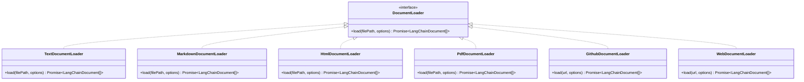

| Module | File | Method |
|---|---|---|
| **TextDocumentLoader** | `src/loaders/textLoader.ts` | UTF-8 file read, returns single document |
| **MarkdownDocumentLoader** | `src/loaders/markdownLoader.ts` | Text read with `isMarkdown` and `preserveStructure` metadata |
| **HtmlDocumentLoader** | `src/loaders/htmlLoader.ts` | Regex-based: strips `<script>`, `<style>`, comments, all tags; decodes HTML entities; normalizes whitespace |
| **PdfDocumentLoader** | `src/loaders/pdfLoader.ts` | Delegates to LangChain `PDFLoader` (`pdf-parse`), optional page splitting |
| **GithubDocumentLoader** | `src/loaders/githubLoader.ts` | Delegates to LangChain `GithubRepoLoader`, supports GitHub Enterprise |
| **WebDocumentLoader** | `src/loaders/webLoader.ts` | Delegates to `CheerioWebBaseLoader`, security checks (rejects 401/403, login redirects, password fields) |

### Chunking Configuration

| Setting | Default | Description |
|---|---|---|
| `chunkSize` | 512 | Target characters per chunk |
| `chunkOverlap` | 50 | Overlap between adjacent chunks |
| `preserveStructure` | true | Keep heading hierarchy (Markdown) |

**Recommended chunk sizes by use case:**

| Use Case | Chunk Size |
|---|---|
| Q&A | 500 |
| Search | 1000 |
| Summarization | 2000 |

---

## 4. Query Execution Pipeline

### End-to-End Flow

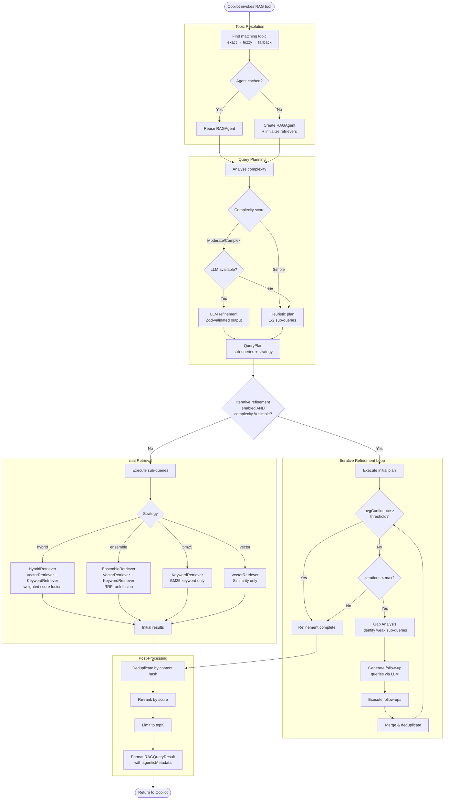

### Query Planning: Complexity Analysis

The `QueryPlannerAgent` scores query complexity using heuristics:

| Factor | Weight | Example |
|---|---|---|
| Sentence/clause count | +1 per extra sentence | "How does X work? And how about Y?" |
| Question words | +1 per question word | what, how, why, when, where |
| Comparison indicators | +2 | "compare X vs Y", "difference between" |
| Word count > 25 | +1 | Long, detailed queries |
| Conjunctions | +0.5 | and, or, but, also |

**Complexity mapping:**

| Score | Classification | Sub-queries |
|---|---|---|
| 0–2 | Simple | 1 (passthrough) |
| 3–5 | Moderate | 2–3 |
| 6+ | Complex | 3–5 |

---

## 5. Iterative Refinement & Gap Analysis

### Refinement Loop Sequence

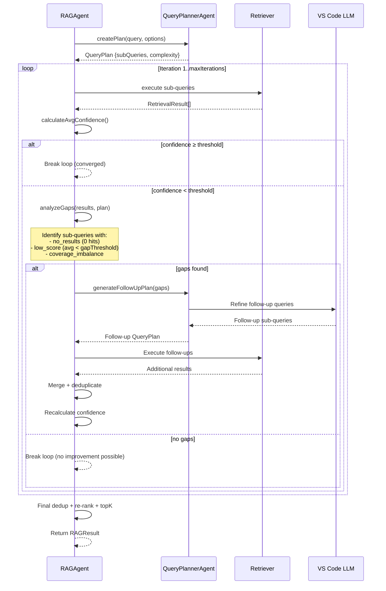

### Gap Analysis Logic

Gap analysis evaluates each sub-query's retrieval quality:

```
For each sub-query in the plan:
  1. Filter results attributed to this sub-query
  2. Calculate: resultCount, avgScore
  3. Classify gap reason:
     - no_results: resultCount === 0
     - low_score:  avgScore < gapScoreThreshold (default: 0.4)
     - coverage_imbalance: resultCount < expected proportion
```

### Follow-Up Query Generation

When gaps are detected, the system generates targeted follow-up queries:

1. **LLM path** — Sends gap context to `QueryPlannerAgent` for LLM refinement
2. **Heuristic fallback** — Generates reformulated queries using keyword extraction
3. **Circuit breaker** — Stops if follow-ups would exceed `maxIterations`
4. **Fair allocation** — Distributes follow-up budget proportionally across gaps

### Convergence Detection

The loop terminates when any of these conditions are met:

| Condition | Description |
|---|---|
| Confidence met | `avgConfidence ≥ confidenceThreshold` |
| Max iterations | `iteration ≥ maxIterations` |
| No gaps found | Gap analysis returns empty list |
| Cancellation | `token.isCancellationRequested` |

---

## 6. Embedding Subsystem

### Backend Selection Flow

```mermaid
flowchart TD
    START([Embedding request]) --> RESOLVE{Backend config}

    %% use plain labels (no inner quotes or HTML) to avoid parser issues
    RESOLVE -->|auto (default)| AUTO{VS Code LM API available?}
    AUTO -->|Yes| VSCODE[VscodeLmBackend]
    AUTO -->|No| HF[HuggingFaceBackend]

    RESOLVE -->|vscodeLM| FORCE_VS{API available?}
    FORCE_VS -->|Yes| VSCODE
    FORCE_VS -->|No| ERROR([Error: API unavailable])

    RESOLVE -->|huggingface| HF

    VSCODE --> EXEC[Execute embedding]
    HF --> EXEC

    EXEC --> FAIL{Failure?}
    FAIL -->|No| RETURN([Return vectors])
    FAIL -->|Yes + auto mode| FALLBACK[Switch to HuggingFace\nShow warning]
    FAIL -->|Yes + forced| ERROR2([Propagate error])
    FALLBACK --> HF
```

### Backend Comparison

| Feature | HuggingFace | VS Code LM |
|---|---|---|
| **Runtime** | ONNX / WASM (local) | VS Code proposed API |
| **Models** | Xenova/* (bundled or downloaded) | Copilot-provided |
| **Latency** | ~50ms first load, ~5ms after | API-dependent |
| **Offline** | Yes | No |
| **Dimensions** | Model-dependent (384/768) | Provider-dependent |
| **Batch** | Sequential (per text) | Native batch API |

### Class Diagram: Embedding Subsystem

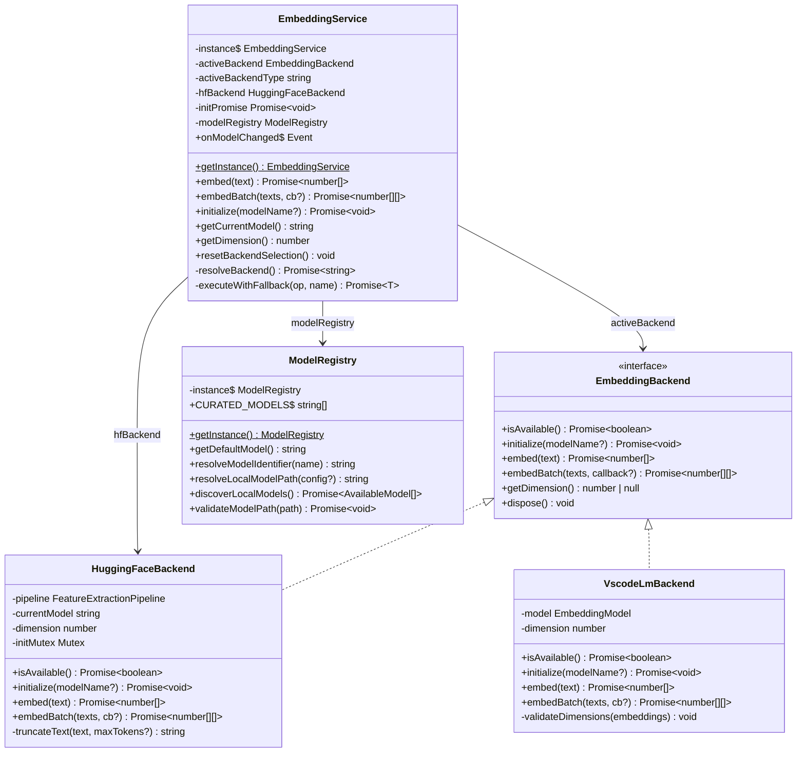

---

## 7. Retrieval Strategies

### Strategy Comparison

| Strategy | Semantic | Keyword | Speed | Memory | Best For |
|---|---|---|---|---|---|
| **Vector** | Yes | No | Fast | Medium | Pure semantic similarity |
| **Hybrid** (default) | Yes | Yes | Medium | Medium | General purpose |
| **Ensemble (RRF)** | Yes | Yes | Medium-Slow | High | Robustness, multi-signal |
| **BM25** | No | Yes | Fast | High | Exact term match, code, IDs |

### Hybrid Retrieval Scoring

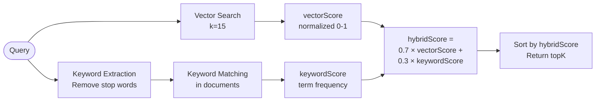

### Ensemble (RRF) Fusion

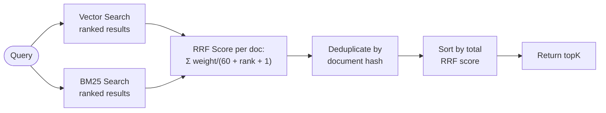

### Retriever Class Diagram

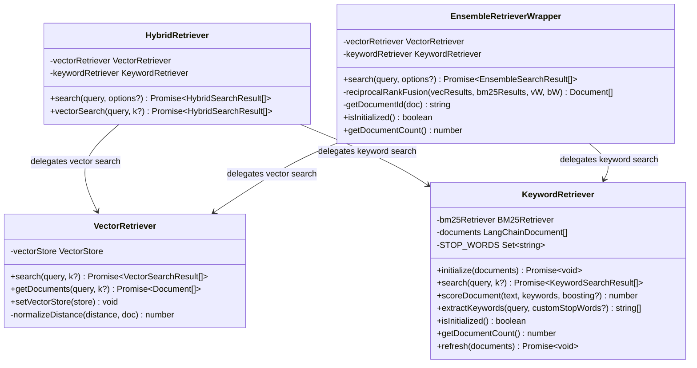

---

## 8. Class Diagram

### Full System Class Relationships

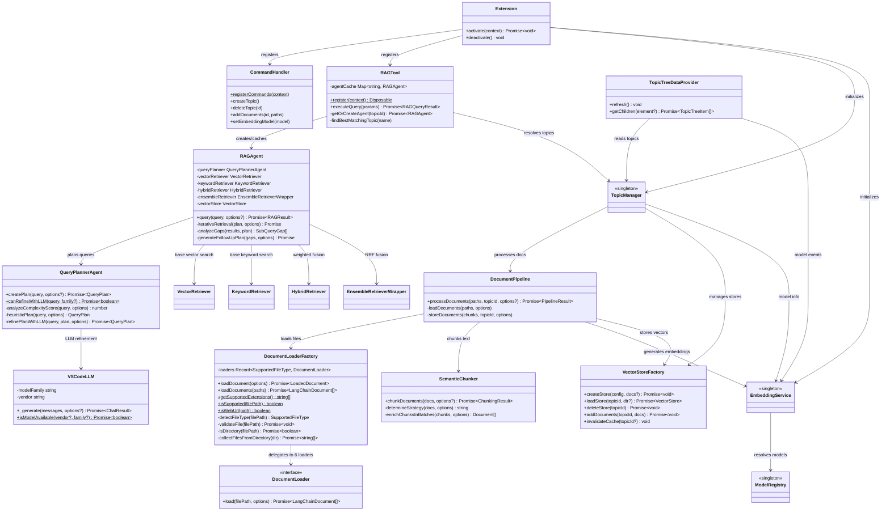

---

## 9. Sequence Diagrams

### 9.1 Extension Activation

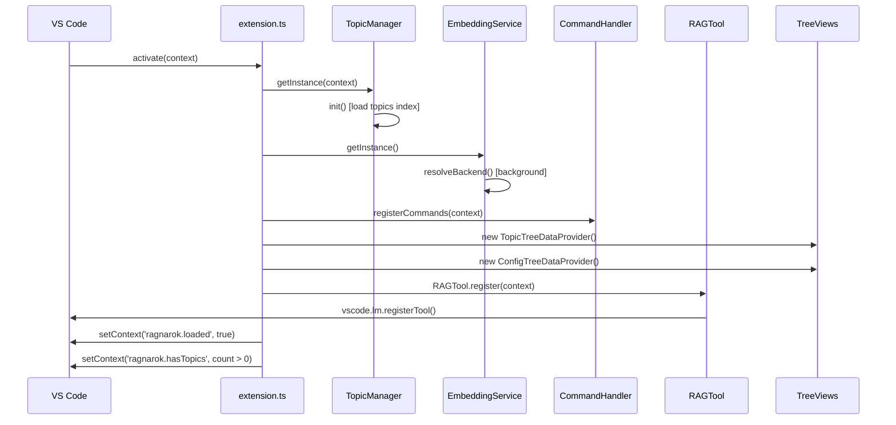

### 9.2 Document Ingestion

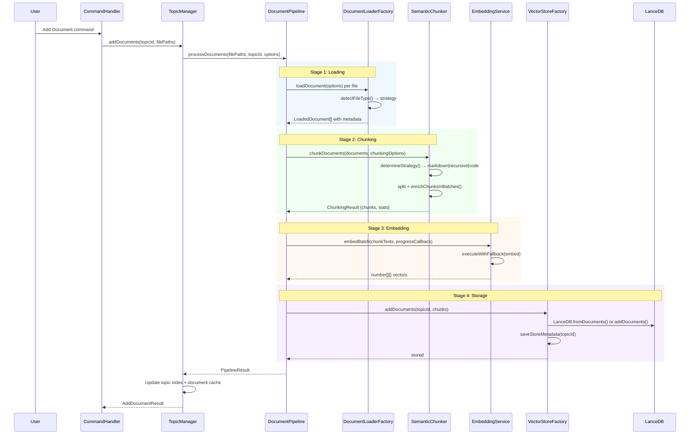

### 9.3 Agentic Query Execution

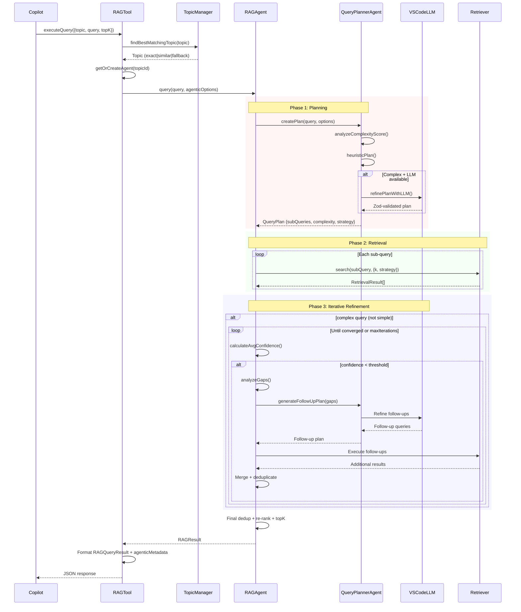

### 9.4 Embedding Backend Fallback

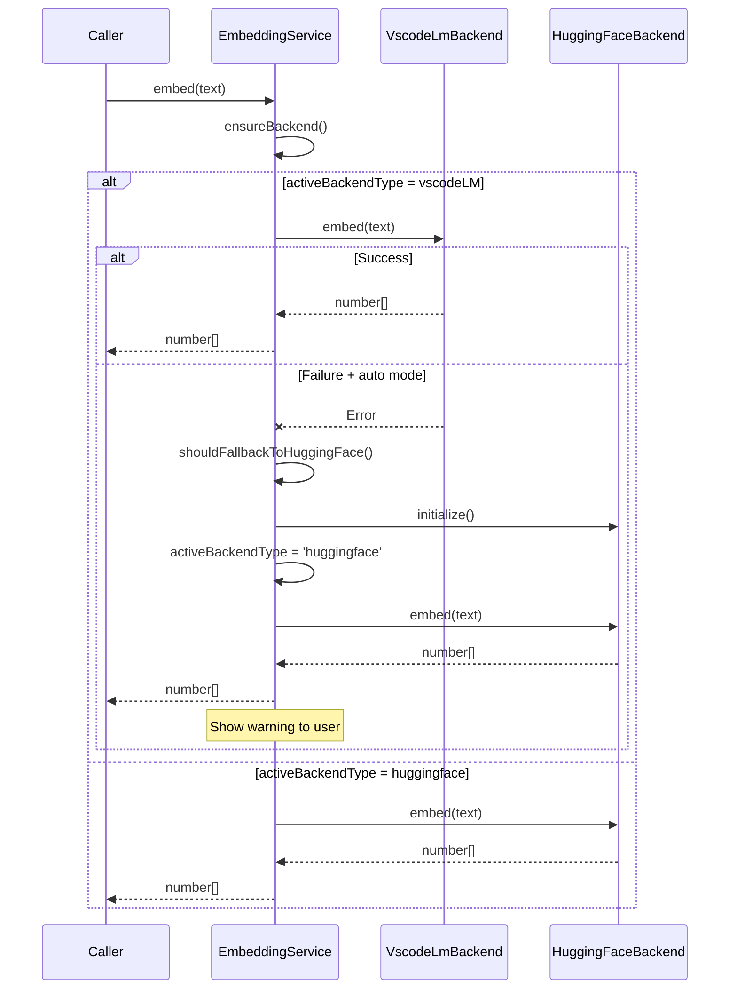

---

## 10. Storage & Persistence

### File System Layout

```
${extensionStorageDir}/
├── database/
│   ├── topics.json                    # Global topics index
│   ├── lancedb/
│   │   ├── ${topicId}/               # Per-topic LanceDB table
│   │   │   ├── ${topicId}.lance      # Vector data
│   │   │   └── .lancedb/            # Table metadata/index
│   │   └── ...
│   ├── documents/
│   │   ├── ${topicId}.json           # Document metadata per topic
│   │   └── ...
│   └── metadata/
│       ├── ${topicId}.json           # Vector store metadata
│       └── ...
└── common-db/                         # Optional shared database
    └── (same structure as database/)
```

### Data Model

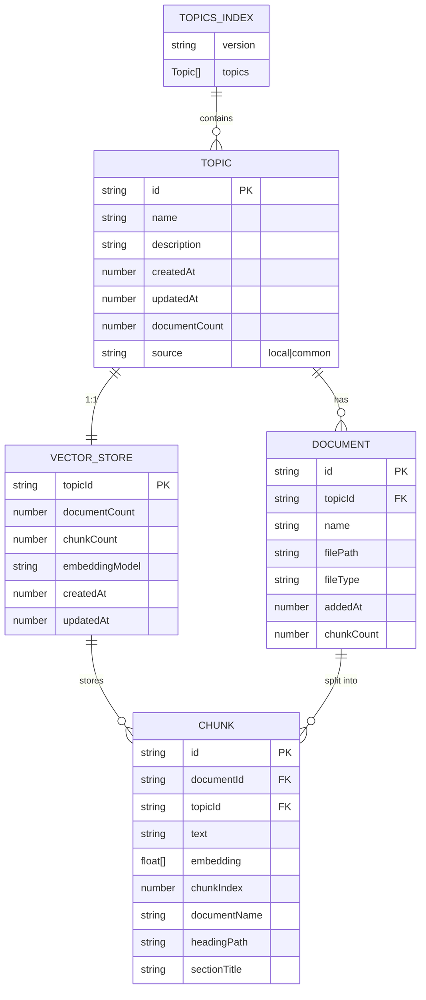

### Caching Strategy

| Cache | Scope | Size Limit | Eviction |
|---|---|---|---|
| **RAGAgent** | Per topic | 10 agents | LRU on overflow |
| **VectorStore** | Per topic | 50 stores | LRU on overflow |
| **QueryPlan** | Per query hash | 50 plans | 1-minute TTL |
| **Topic documents** | Per topic | Unbounded | On topic delete |

---

## 11. Configuration Reference

All settings are under the `ragnarok.*` namespace.

### Core Settings

| Setting | Type | Default | Description |
|---|---|---|---|
| `topK` | number | 5 | Number of results per query |
| `chunkSize` | number | 512 | Target chunk size (characters) |
| `chunkOverlap` | number | 50 | Overlap between adjacent chunks |
| `retrievalStrategy` | enum | `hybrid` | `vector` \| `hybrid` \| `ensemble` \| `bm25` |
| `logLevel` | enum | `info` | `debug` \| `info` \| `warn` \| `error` |

### Embedding Settings

| Setting | Type | Default | Description |
|---|---|---|---|
| `embeddingBackend` | enum | `auto` | `auto` \| `huggingface` \| `vscodeLM` |
| `embeddingVscodeModelId` | string | `""` | VS Code LM model identifier |
| `localModelPath` | string | `""` | Custom local model directory |

### Query Settings

| Setting | Type | Default | Description |
|---|---|---|---|
| `maxIterations` | number | 3 | Max refinement iterations |
| `confidenceThreshold` | number | 0.7 | Min confidence to stop refining |
| `llmModel` | string | `gpt-4o-mini` | LLM model family for planning |
| `includeWorkspaceContext` | boolean | true | Include open files as context |
| `gapScoreThreshold` | number | 0.4 | Min avg score before gap is flagged |

### Advanced Settings

| Setting | Type | Default | Description |
|---|---|---|---|
| `commonDatabasePath` | string | `""` | Path to shared read-only database |

---

## 12. Commands Reference

All commands are under the `ragnarok.*` namespace.

### Topic Management

| Command | Title | Description |
|---|---|---|
| `ragnarok.createTopic` | Create New Topic | Create a new RAG topic with name and description |
| `ragnarok.deleteTopic` | Delete Topic | Remove a topic and its vector store |
| `ragnarok.renameTopic` | Rename Topic | Rename an existing topic |
| `ragnarok.exportTopic` | Export Topic | Export topic data to a portable format |
| `ragnarok.importTopic` | Import Topic | Import a previously exported topic |

### Document Ingestion

| Command | Title | Description |
|---|---|---|
| `ragnarok.addDocument` | Add Document to Topic | Add local files (PDF, MD, HTML, TXT) or directories |
| `ragnarok.addGithubRepo` | Add GitHub Repo to Topic | Ingest a GitHub repository (with optional token) |
| `ragnarok.addWebUrl` | Add Web URL to Topic | Load a web page; auto-detects GitHub URLs and routes to repo ingestion |

### Embedding & Model Configuration

| Command | Title | Description |
|---|---|---|
| `ragnarok.setEmbeddingModel` | Set Embedding Model | Choose between HuggingFace and VS Code LM backends |
| `ragnarok.selectVscodeEmbeddingModel` | Select VS Code Embedding Model | Pick from available VS Code LM embedding models |
| `ragnarok.selectHfEmbeddingModel` | Select HuggingFace Model | Pick from curated or custom HuggingFace models |
| `ragnarok.selectLLMModel` | Select LLM Model | Choose LLM for agentic query planning |

### GitHub Token Management

| Command | Title | Description |
|---|---|---|
| `ragnarok.addGithubToken` | Add GitHub Token | Store a PAT for GitHub API access (5000 req/hr) |
| `ragnarok.listGithubTokens` | List GitHub Tokens | View stored tokens by host |
| `ragnarok.removeGithubToken` | Remove GitHub Token | Delete a stored token |

### Maintenance

| Command | Title | Description |
|---|---|---|
| `ragnarok.refreshTopics` | Refresh Topics | Reload topic tree view |
| `ragnarok.clearModelCache` | Clear Model Cache | Remove cached embedding model files |
| `ragnarok.clearDatabase` | Clear Database | Delete all topics and vector data |
| `ragnarok.editConfigItem` | Edit Config Item | Modify a configuration setting inline |
