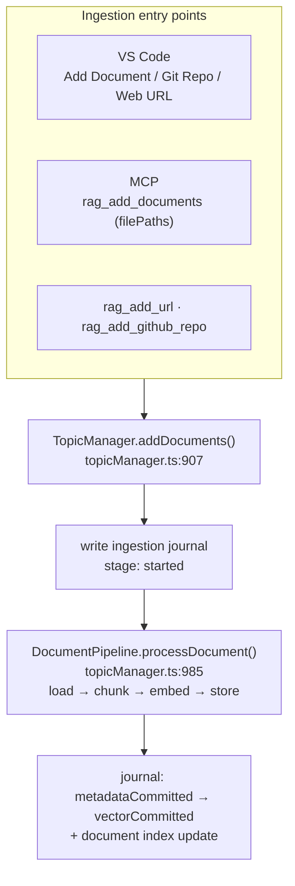
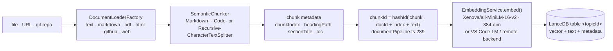
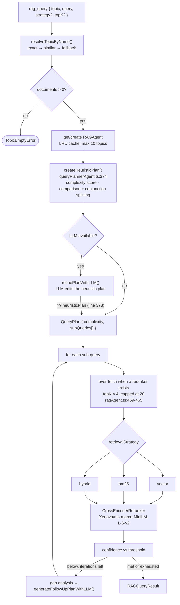
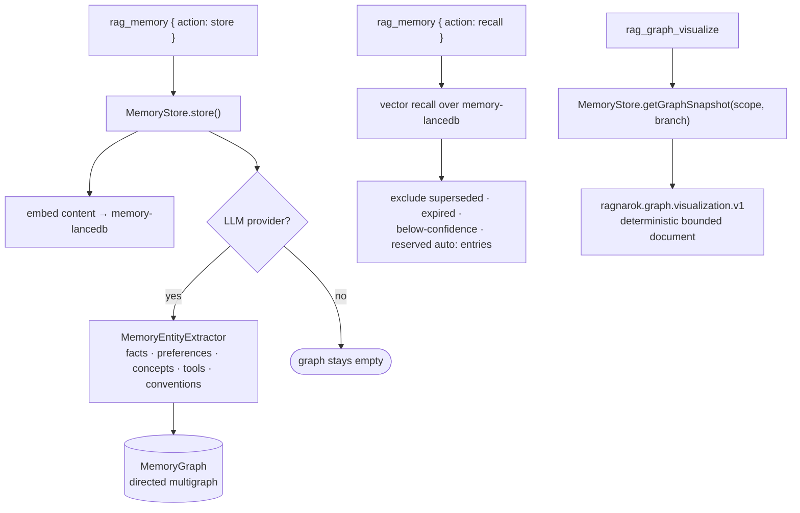

# How RAGnarōk works: ingestion to retrieval

Traced from source at commit `48a645e`. File and line references are load-bearing — this describes
what the code does, not what it intends to do.

There is no document knowledge graph. Entity extraction over ingested documents, the `graph` and
`graph_hybrid` retrieval strategies, the `ensemble` strategy, the LangGraph orchestration layer, and
the LanceDB checkpointer have all been removed. Graphs exist only in the memory subsystem (§6).

---

## 1. The shape of the whole system

Every ingestion entry point converges on one method, and every query converges on another.



There is exactly one ingestion path. Storage mutation is serialized by a process-wide mutex plus a
per-topic mutex, and the ingestion journal survives ordinary failures so that a partially applied
write is repaired rather than guessed at.

---

## 2. Ingestion



Defaults: `chunkSize` 1000 characters, `chunkOverlap` 200 (`semanticChunker.ts:76-77`). The chunk id
is content-hashed, so **re-chunking changes every id** — which is why altering chunking is a storage
migration, not a tweak.

Ingestion needs no LLM. An LLM provider only affects query planning (§3) and memory entity
extraction (§6).

---

## 3. Retrieval — the query pipeline



The planner is **heuristic-first**: `queryPlannerAgent.ts:374` builds a plan and the LLM only _edits_
it, falling back with `?? heuristicPlan` at line 378. Decomposition therefore works with no LLM at
all. The only capability genuinely lost without a provider is iterative refinement —
`generateFollowUpPlanWithLLM()` returns `null` (`ragAgent.ts:839-855`).

Strategy dispatch is a three-way branch (`ragAgent.ts:414-434`). Retrievers are constructed lazily by
`initializeRetrieversForStrategy()`; if the requested one is still absent afterwards, dispatch
**throws** `Retriever for strategy <s> not initialized` rather than silently substituting another
strategy. Every result carries the `effectiveStrategy` that actually ran.

Reranking overwrites `scoreKind` with `cross_encoder_probability` and preserves the first-stage value
in `originalScoreKind`.

---

## 4. The three strategies

| Strategy | Mechanism                                                                                                                                                                                                                                                                                                                                                                            |
| -------- | ------------------------------------------------------------------------------------------------------------------------------------------------------------------------------------------------------------------------------------------------------------------------------------------------------------------------------------------------------------------------------------ |
| `vector` | LanceDB ANN over chunk embeddings; squared-L2 converted to the unit-vector cosine score contract                                                                                                                                                                                                                                                                                     |
| `bm25`   | genuine Okapi BM25. `search()` delegates to LangChain's `BM25Retriever` (`keywordRetriever.ts:10,47`), which scores with IDF `log((N − n + 0.5) / (n + 0.5) + 1)` and the usual saturation term at k1=1.2, b=0.75                                                                                                                                                                    |
| `hybrid` | weighted blend of semantic + keyword; defaults `vectorWeight` 0.9 / `keywordWeight` 0.1 (`hybridRetriever.ts:29-31`). Candidates come from the real BM25 `search()` (`hybridRetriever.ts:111`), but the lexical score actually blended in is `scoreDocument` — log-TF × length-norm × position boost, **no IDF** (`keywordRetriever.ts:141,144`, called at `hybridRetriever.ts:140`) |

Cross-encoder reranking is an orthogonal second stage available to all three.

Measured quality for these strategies across SciFact, NFCorpus, FiQA, and FRAMES is in
[BENCHMARKS.md](../BENCHMARKS.md); the enforced release thresholds are in
[docs/BENCHMARKS.md](BENCHMARKS.md).

---

## 5. Storage layout

```
<storage>/
  storage-format.json        v2 marker
  .ragnarok.lock             fenced single-writer lease
  database/
    topics.json
    topic-<id>-documents.json
    ingestion-journal.json
    lancedb/
      <topicId>.lance        chunk vectors — the only per-topic table
  memory-lancedb/            personal memory
  memory-manifest.json
  exports/                   .rag archives
```

Feature directories are created lazily. There are no `kg-*` tables and no `checkpoints-lancedb/`
directory; the offline migrator recognizes legacy `kg-*` tables only so it can drop them without
treating them as unknown structure (see [MIGRATION.md](../MIGRATION.md)).

---

## 6. Memory — the only graph in the system

Memory is personal: it exists in the VS Code extension and in the MCP server, both of which run as
the local user.



Two consequences worth stating plainly:

- **Memory is explicit.** There is no automatic query-time recall and no automatic write-back of
  query insights; that behavior lived in the deleted LangGraph path. Memory changes only through
  `rag_memory` calls.
- **The graph is LLM-gated.** Without a configured LLM provider, memories are still stored and
  recalled by vector similarity, but `MemoryGraph` stays empty and every visualization is a
  successful empty document — not an error.

`rag_graph_visualize` is registered on every connection, like every other tool.
`maxNodes` defaults to 500 (range 1–2,000), projection retains at
most 10,000 edges, and oversized records return `GRAPH_VISUALIZATION_RECORD_TOO_LARGE`. See the
[MCP server contract](../packages/mcp-server/README.md#memory-graph-visualization).

---

## 7. Known issues

- `hybrid`'s lexical half is TF-only despite the BM25-adjacent naming around it: `scoreDocument`
  (`keywordRetriever.ts:119-150`) has no IDF and no document-frequency term, so the keyword component
  of the blend is not Okapi BM25 — even though the standalone `bm25` strategy is.
- The offline migrator still emits a `graphRebuildRequired` flag and a "rebuild is required" warning
  for legacy `kg-*` tables. Both are vestigial: there is nothing to rebuild and no strategy that
  would consume the result.
- `ragnarok.commonDatabasePath` is contributed as a VS Code setting but `adapters.ts` hard-codes it
  to `""` for the MCP server, so shared/common read-only topics are a VS Code-only capability.
