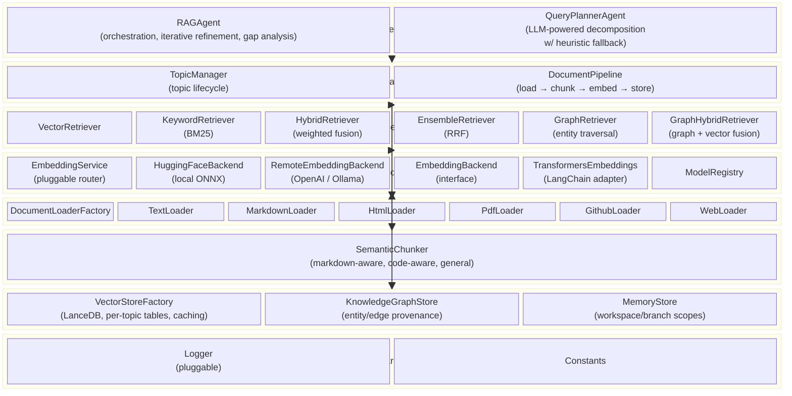

# @ragnarok/core

Portable RAG engine — document loading, embedding, vector storage, and retrieval.

`@ragnarok/core` is the foundation of the RAGnarōk monorepo. It implements the
full retrieval-augmented generation pipeline behind a set of host-agnostic
interfaces so the same engine can run inside VS Code, an MCP server, or any
other Node.js host.

---

## Architecture Overview



---

## Module Layout

```
src/
├── index.ts                   # Public API barrel export
├── interfaces.ts              # Portable interfaces (IConfigProvider, ILogger, …)
├── constants.ts               # Shared constants & config keys
├── logger.ts                  # Pluggable logger (setLoggerFactory)
│
├── agents/
│   ├── ragAgent.ts            # Orchestrates retrieval, iterative refinement, gap analysis
│   └── queryPlannerAgent.ts   # LLM-powered query decomposition with heuristic fallback
│
├── managers/
│   ├── topicManager.ts        # Topic CRUD, metadata persistence, lifecycle
│   └── documentPipeline.ts    # End-to-end: load → chunk → embed → store
│
├── retrievers/
│   ├── ensembleRetriever.ts   # Reciprocal Rank Fusion across sub-retrievers
│   ├── hybridRetriever.ts     # Weighted fusion of vector + keyword
│   ├── vectorRetriever.ts     # Squared-L2 to unit-cosine score contract
│   ├── keywordRetriever.ts    # BM25 keyword scoring
│   ├── graphRetriever.ts      # Entity matching, traversal, provenance
│   └── graphHybridRetriever.ts # Graph/vector score fusion
│
├── embeddings/
│   ├── embeddingService.ts        # Pluggable backend router — selects active embedding backend
│   ├── embeddingBackend.ts        # Backend interface (EmbeddingBackend)
│   ├── huggingFaceBackend.ts      # Local ONNX inference via @xenova/transformers
│   ├── remoteEmbeddingBackend.ts  # Remote HTTP backends (OpenAI / Ollama formats)
│   ├── langchainEmbeddings.ts     # TransformersEmbeddings LangChain adapter
│   └── modelRegistry.ts           # Tracks available / downloaded models
│
├── loaders/
│   ├── documentLoaderFactory.ts # Picks loader by extension / URI scheme
│   ├── textLoader.ts          # Plain text files
│   ├── markdownLoader.ts      # Markdown files
│   ├── htmlLoader.ts          # HTML → text extraction
│   ├── pdfLoader.ts           # PDF → text extraction
│   ├── githubLoader.ts        # GitHub repository ingestion
│   ├── webLoader.ts           # Web URL fetching
│   └── types.ts               # Loader type definitions
│
├── splitters/
│   └── semanticChunker.ts     # Markdown-aware, code-aware, general chunking
│
├── stores/
│   ├── vectorStoreFactory.ts  # LanceDB store creation, per-topic tables, caching
│   ├── knowledgeGraphStore.ts # Persistent topic graphs and fingerprints
│   └── lanceDBCheckpointer.ts # LangGraph checkpoint persistence
├── memory/                    # Scoped memory, vector recall, graph, decay/export
│
└── utils/                     # Shared helpers
```

---

## Core Interfaces (Portability Layer)

The engine depends on
four tiny interfaces that each host implements:

| Interface                                    | Purpose                                            |
| -------------------------------------------- | -------------------------------------------------- |
| `IConfigProvider`                            | Read configuration values (`get<T>(key, default)`) |
| `ILogger` / `ILoggerFactory`                 | Pluggable structured logging                       |
| `INotifier`                                  | User-facing notifications & progress reporting     |
| `ILLMProvider` / `ILLMModel` / `ILLMMessage` | LLM access for agentic query planning              |

These are defined in `src/interfaces.ts` and consumed throughout the codebase.

---

## Key Design Patterns

| Pattern              | Where                                         | Why                                                             |
| -------------------- | --------------------------------------------- | --------------------------------------------------------------- |
| **Adapter**          | `interfaces.ts` → host-specific adapters      | Keeps the core free of host dependencies                        |
| **Factory**          | `DocumentLoaderFactory`, `VectorStoreFactory` | Picks the right implementation by file type / config            |
| **Pipeline**         | `DocumentPipeline`                            | Composes load → chunk → embed → store as a single unit of work  |
| **Strategy**         | Retrieval strategies, chunking strategies     | Swap algorithms at runtime without touching orchestration       |
| **Agent**            | `RAGAgent`, `QueryPlannerAgent`               | Confidence-based iterative refinement with LLM-powered planning |
| **Pluggable logger** | `setLoggerFactory()`                          | Host installs its own logger before any code runs               |

---

## Retrieval Strategies

The engine supports six retrieval strategies, selectable per query:

| Strategy         | Algorithm                                          | When to use                                                 |
| ---------------- | -------------------------------------------------- | ----------------------------------------------------------- |
| **VECTOR**       | Cosine similarity over embedded vectors            | Best for semantic / natural-language queries                |
| **BM25**         | TF-IDF keyword scoring                             | Best for exact term matching (e.g. error messages)          |
| **HYBRID**       | Weighted linear fusion of vector + BM25 scores     | Balanced default — combines semantic and lexical signals    |
| **ENSEMBLE**     | Reciprocal Rank Fusion (RRF) across sub-retrievers | Most robust — merges ranked lists without score calibration |
| **GRAPH**        | Entity match plus relationship traversal           | Explainable entity/neighborhood queries when a graph exists |
| **GRAPH_HYBRID** | Weighted graph and vector fusion                   | Semantic recall plus graph provenance                       |

Vector retrieval converts LanceDB squared-L2 distances to the repository's
unit-vector cosine score contract. Results identify their effective strategy,
score kind, components, graph entities/hops, and any fallback reason. A graph
request that falls back is labeled with its actual strategy.

Topic and graph metadata persist the complete embedding fingerprint, not only
vector dimension. Changing backend, model, revision, normalization, or distance
contract requires reindexing. Fingerprint mismatch is a hard error and is never
hidden by graph-hybrid fallback.

## Storage compatibility

Core owns the v2 marker, lease, topic/vector/graph stores, standalone memory,
checkpoints, archive validation, and the offline legacy migrator. One storage
root has one writer. See the repository [architecture](../../ARCHITECTURE.md),
[migration guide](../../MIGRATION.md), and
[operations guide](../../docs/OPERATIONS.md).

---

## Usage

Instantiate the core with mock adapters (no VS Code required):

```ts
import { EmbeddingService, DocumentPipeline, TopicManager, IConfigProvider, INotifier } from "@ragnarok/core";

const config: IConfigProvider = { get: (key, def) => def };
const notifier: INotifier = {
  showInfo: () => {},
  showWarning: () => {},
  showError: () => {},
  withProgress: async (_, task) => task(() => {}),
};

const embeddingService = new EmbeddingService({ config, notifier });
const pipeline = new DocumentPipeline(notifier, embeddingService, config);
await pipeline.initialize("/path/to/storage");
```

See `packages/mcp-server` for a full non–VS Code integration.
