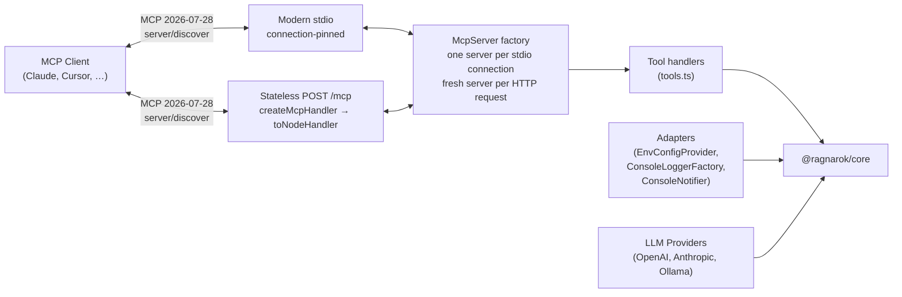

# @ragnarok/mcp-server

MCP server exposing RAGnarōk tools to any MCP-compatible agent — Claude Desktop,
Cursor, VS Code (via MCP client), CLI tools, and more.

RAGnarok 0.6.0 serves MCP protocol `2026-07-28` only. Clients must use
`server/discover` or modern version negotiation; legacy `initialize` is
rejected and there is no compatibility mode.

---

## Architecture



HTTP adapts the SDK's stateless `createMcpHandler` with `toNodeHandler`; it does
not retain an MCP transport session between requests.

---

## Deployment and capability matrix

The server registers up to 27 tools. The visible surface is constructed for
the authenticated role, so an MCP client cannot even discover tools outside
its capability.

| Capability                         | Local stdio        | Local HTTP owner | Shared reader | Shared curator | Shared admin |
| ---------------------------------- | ------------------ | ---------------- | ------------- | -------------- | ------------ |
| Query/list/status                  | Yes                | Yes              | Yes           | Yes            | Yes          |
| Create/mutate topics and documents | Yes                | Yes              | No            | Yes            | Yes          |
| Upload and ingest documents        | N/A (server paths) | Yes              | No            | Yes            | Yes          |
| Switch embedding/reranker model    | Yes                | Yes              | No            | No             | Yes          |
| Export/import topic archives       | Yes                | Yes              | No            | No             | Yes          |
| Reset standalone memory            | Yes                | Yes              | No            | No             | No           |
| Project/branch memory              | Yes                | Yes              | No            | No             | No           |

Shared mode deliberately excludes personal memory. Server-path ingestion reads
paths on the MCP host and is restricted to configured roots. Remote clients
use checksum-declared upload/download handles instead.

## MCP Tools

| Tool                         | Description                                                                                          | Parameters                                                                                                                                                         |
| ---------------------------- | ---------------------------------------------------------------------------------------------------- | ------------------------------------------------------------------------------------------------------------------------------------------------------------------ |
| `rag_query`                  | Query a topic with RAG (supports agentic multi-step planning)                                        | `topic` (string), `query` (string), `topK?` (number), `retrievalStrategy?` (`"vector"` \| `"hybrid"` \| `"bm25"`)                                                   |
| `rag_list_topics`            | List all available topics with metadata                                                              | _(none)_                                                                                                                                                           |
| `rag_topic_stats`            | Get statistics for a topic                                                                           | `topic` (string)                                                                                                                                                   |
| `rag_create_topic`           | Create a new topic                                                                                   | `name` (string), `description?` (string)                                                                                                                           |
| `rag_add_documents`          | Add documents to a topic (paths must be inside `RAGNAROK_ALLOWED_PATHS`)                             | `topic` (string), `filePaths` (string[])                                                                                                                           |
| `rag_create_document_upload` | Create a bounded shared-mode document upload handle                                                  | `filename`, `contentType`, `size`, `sha256`                                                                                                                        |
| `rag_ingest_upload`          | Consume a completed shared-mode document upload into a topic                                         | `topic`, `uploadId`                                                                                                                                                |
| `rag_list_embedding_models`  | List available embedding models                                                                      | _(none)_                                                                                                                                                           |
| `rag_embedding_info`         | Get current embedding model info                                                                     | _(none)_                                                                                                                                                           |
| `rag_switch_embedding_model` | Switch the active embedding model                                                                    | `model` (string)                                                                                                                                                   |
| `rag_llm_status`             | Get LLM provider status and configuration                                                            | _(none)_                                                                                                                                                           |
| `rag_list_reranker_models`   | List available cross-encoder reranker models                                                         | _(none)_                                                                                                                                                           |
| `rag_reranker_info`          | Get current reranker configuration and status                                                        | _(none)_                                                                                                                                                           |
| `rag_switch_reranker_model`  | Switch the cross-encoder reranker model                                                              | `model` (string)                                                                                                                                                   |
| `rag_memory`                 | Project memory: store, recall, forget (incl. `expired`), stats, list, decay, history, promote, links | `action` (string) plus action-specific fields (`content`, `query`, `id`, `scope`, `branch`, `tags`, `topK`, `olderThan`, `expired`, `limit`, `includeEntities`)    |
| `rag_list_documents`         | List a topic's indexed source documents                                                              | `topic` (string)                                                                                                                                                   |
| `rag_delete_topic`           | Delete a topic and all managed data                                                                  | `topic` (string), `confirm` (`true`)                                                                                                                               |
| `rag_remove_document`        | Remove one document and its chunks                                                                   | `topic` (string), `documentId` (string), `confirm` (`true`)                                                                                                        |
| `rag_rename_topic`           | Rename a topic                                                                                       | `topic` (string), `newName` (string)                                                                                                                               |
| `rag_graph_visualize`        | Return a deterministic local memory graph and associate the MCP App (local deployments only)         | One exact input shape from [Memory graph visualization](#memory-graph-visualization)                                                                               |
| `rag_add_url`                | Securely ingest a public HTTP(S) URL                                                                 | `topic` (string), `url` (string)                                                                                                                                   |
| `rag_add_github_repo`        | Ingest an allowlisted GitHub/GHES repository                                                         | `topic` (string), `url` (string), `branch?` (string)                                                                                                               |
| `rag_export_topic`           | Export a checksummed storage-format-v2 `.rag` archive                                                | `topic` (string)                                                                                                                                                   |
| `rag_import_topic`           | Import a validated `.rag` archive from an allowlisted path                                           | `archivePath` (string), `confirm` (`true`)                                                                                                                         |
| `rag_create_archive_upload`  | Create an admin-only shared-mode archive upload handle                                               | `filename`, `contentType`, `size`, `sha256`                                                                                                                        |
| `rag_import_upload`          | Consume and validate an uploaded `.rag` archive                                                      | `uploadId`, `confirm` (`true`)                                                                                                                                     |
| `rag_reset_memory`           | Delete standalone memory after explicit confirmation                                                 | `confirm` (`true`)                                                                                                                                                 |
| `rag_storage_status`         | Report storage format, location, and reset requirements                                              | _(none)_                                                                                                                                                           |

---

## Memory graph visualization

Graphs exist only in the memory subsystem. There is no document knowledge
graph, and `rag_graph_visualize` has no knowledge input.

Because memory is always personal, the tool is registered only when a memory
store is present and the deployment is not shared — that is, local stdio and
local HTTP, for curators and admins. Shared deployments do not register it at
all, so it never appears in `tools/list` and any invocation is an unknown-tool
error rather than an authorization error. The tool accepts exactly one of these
discriminated inputs; fields from the other branch of the union and other
unknown fields are rejected:

```ts
{ source: "memory", memoryScope: "workspace", maxNodes?: number }
{ source: "memory", memoryScope: "branch", branch: string, maxNodes?: number }
```

`branch` is trimmed, must contain 1 through 255 characters, is required only for
branch memory, and identifies that exact stored branch graph; an absent branch
graph returns a successful empty document. Workspace memory uses the single
workspace scope. `maxNodes` defaults to 500 and accepts integers 1 through
2,000. Projection retains at most 10,000 edges, and final wrapped results remain
within the configured response limit (1 MiB by default).

The memory graph is built by memory entity extraction, which requires a
configured LLM provider. Without one, memories are still stored and recalled by
vector similarity, the graph stays empty, and every visualization is a
successful empty document.

The first published output schema is
`ragnarok.graph.visualization.v1`. The unpublished
`ragnarok.graph.layout.v1` schema was removed and is not accepted or emitted.
The deterministic document includes source identity, positioned nodes, edges,
groups, viewport bounds, original/retained counts, empty/truncated status, and
ordered truncation reasons. Clients without MCP Apps can consume the same
document from text or `structuredContent` as machine-readable JSON.

Results contain complete persisted non-vector details. Memory node attributes
include `description`, `scope`, optional `branch`, `confidence`, `strength`,
`createdAt`, `updatedAt`, `sourceMemoryIds`, and `metadata`. Edge attributes
include the corresponding persisted description, provenance, confidence,
scope/branch, and metadata fields. Arbitrary metadata can contain sensitive
memory content. Embedding vectors are always excluded.

A record too large to fit the response limit returns
`GRAPH_VISUALIZATION_RECORD_TOO_LARGE`; any other failure returns
`GRAPH_VISUALIZATION_FAILED`. Both are stable tool errors in text and structured
content, never fallback or fabricated graph data.

The tool advertises exactly this modern metadata:

```json
{ "ui": { "resourceUri": "ui://ragnarok/graph" } }
```

`resources/list` and `resources/read` use the exact MIME type
`text/html;profile=mcp-app`. The returned HTML is one self-contained,
network-free app with no external scripts. The app starts in a loading state,
renders explicit ready/empty/error states, and clears stale selection and panel
state for every result. Its SVG has an accessible name; graph items use roving
keyboard focus; arrow keys move focus; Enter or Space opens text-only details;
Escape or Close restores focus. Status and error regions are announced,
controls are touch-sized, and reset refits the viewport. A VS Code extension
webview remains deferred; current visualization delivery is the MCP App only.

---

## Module Layout

```
src/
├── index.ts         # Entry point — bootstraps adapters, MCP server, transport
├── config.ts        # McpConfig type & loadConfig() from environment variables
├── adapters.ts      # Console / env adapters for @ragnarok/core interfaces
├── httpServer.ts    # Stateless HTTP (createMcpHandler + toNodeHandler, adapted through Express)
├── llmProviders.ts  # OpenAI, Anthropic, Ollama LLM provider implementations
└── tools.ts         # Tool definitions & handlers (registerTools)
```

---

## Configuration

All settings are read from environment variables at startup:

| Variable                                 | Default                              | Description                                                                                                                                                        |
| ---------------------------------------- | ------------------------------------ | ------------------------------------------------------------------------------------------------------------------------------------------------------------------ |
| `RAGNAROK_STORAGE_DIR`                   | `~/.ragnarok`                        | Database & topic storage directory                                                                                                                                 |
| `RAGNAROK_WORKING_DIR`                   | `process.cwd()`                      | Project root for git-branch-scoped memory                                                                                                                          |
| `RAGNAROK_ALLOWED_PATHS`                 | _(the working dir)_                  | Roots `rag_add_documents` may read, path-delimiter separated                                                                                                       |
| `RAGNAROK_EMBEDDING_MODEL`               | `Xenova/all-MiniLM-L6-v2`            | Embedding model name (HuggingFace or remote)                                                                                                                       |
| `RAGNAROK_EMBEDDING_PROVIDER`            | `huggingface`                        | Embedding provider: `huggingface`, `openai`, `ollama`                                                                                                              |
| `RAGNAROK_EMBEDDING_BASE_URL`            | _(empty)_                            | Remote embedding API base URL (required for openai/ollama)                                                                                                         |
| `RAGNAROK_EMBEDDING_API_KEY`             | _(empty)_                            | API key for remote embedding API                                                                                                                                   |
| `RAGNAROK_CHUNK_SIZE`                    | `1000`                               | Document chunk size (characters)                                                                                                                                   |
| `RAGNAROK_CHUNK_OVERLAP`                 | `200`                                | Overlap between chunks                                                                                                                                             |
| `RAGNAROK_TOP_K`                         | `10`                                 | Default number of results per query                                                                                                                                |
| `RAGNAROK_RETRIEVAL_STRATEGY`            | `hybrid`                             | Default retrieval strategy                                                                                                                                         |
| `RAGNAROK_MAX_ITERATIONS`                | `3`                                  | Max agentic refinement iterations                                                                                                                                  |
| `RAGNAROK_CONFIDENCE_THRESHOLD`          | `0.7`                                | Confidence threshold for early stopping                                                                                                                            |
| `RAGNAROK_LOG_LEVEL`                     | `info`                               | Log level (`debug`, `info`, `warn`, `error`)                                                                                                                       |
| `RAGNAROK_LLM_PROVIDER`                  | `none`                               | LLM provider: `openai`, `anthropic`, `ollama`, `none`                                                                                                              |
| `RAGNAROK_LLM_API_KEY`                   | _(empty)_                            | API key for OpenAI or Anthropic                                                                                                                                    |
| `RAGNAROK_LLM_MODEL`                     | _(per-provider)_                     | LLM model name (e.g. `gpt-4o-mini`, `claude-sonnet-4-20250514`, `llama3`)                                                                                          |
| `RAGNAROK_LLM_BASE_URL`                  | _(per-provider)_                     | LLM API base URL override (Ollama defaults to `http://localhost:11434`; OpenAI/Anthropic use their official endpoints unless set)                                  |
| `RAGNAROK_RERANKER_MODEL`                | `Xenova/ms-marco-MiniLM-L-6-v2`      | Cross-encoder reranker model                                                                                                                                       |
| `RAGNAROK_RERANKER_ENABLED`              | `true`                               | Enable bundled cross-encoder reranking                                                                                                                             |
| `RAGNAROK_RERANKER_MAX_CANDIDATES`       | `20`                                 | Maximum candidates scored by the reranker                                                                                                                          |
| `RAGNAROK_RERANKER_CANDIDATE_MULTIPLIER` | `4`                                  | First-stage over-fetch multiplier                                                                                                                                  |
| `RAGNAROK_API_KEY`                       | _(empty)_                            | HTTP read token; required for non-loopback binds                                                                                                                   |
| `RAGNAROK_WRITE_API_KEY`                 | _(empty)_                            | Distinct HTTP curator token                                                                                                                                        |
| `RAGNAROK_ADMIN_API_KEY`                 | _(empty)_                            | Distinct HTTP admin token for model, archive, and reset operations                                                                                                 |
| `RAGNAROK_DEPLOYMENT_MODE`               | `local` for stdio; required for HTTP | HTTP startup fails unless this is explicitly `local` or `shared`                                                                                                   |
| `RAGNAROK_CORS_ORIGIN`                   | `loopback`                           | Browser Origin policy: loopback origins by default, or one explicit trusted origin                                                                                 |
| `RAGNAROK_HTTP_HOST`                     | `127.0.0.1`                          | HTTP server bind address (`0.0.0.0` for Docker)                                                                                                                    |
| `RAGNAROK_ALLOWED_HOSTS`                 | _(loopback only)_                    | Comma-separated exact HTTP Host names/IPs; required for shared or non-loopback HTTP, without ports or wildcards                                                    |
| `RAGNAROK_TLS_CERT_PATH`                 | _(empty)_                            | Native TLS certificate; must be configured with the key                                                                                                            |
| `RAGNAROK_TLS_KEY_PATH`                  | _(empty)_                            | Native TLS private key; must be configured with the certificate                                                                                                    |
| `RAGNAROK_TRUSTED_PROXIES`               | _(empty)_                            | Comma-separated exact proxy IPs allowed to assert forwarded HTTPS/client IP                                                                                        |
| `RAGNAROK_PORT`                          | `3000`                               | HTTP transport port (when `--http` is used)                                                                                                                        |
| `RAGNAROK_SHUTDOWN_DRAIN_MS`             | `10000`                              | Maximum graceful request-drain interval                                                                                                                            |
| `RAGNAROK_LLM_REQUEST_TIMEOUT_MS`        | `30000`                              | Timeout for one configured LLM request                                                                                                                             |
| `RAGNAROK_MAX_REQUEST_BYTES`             | `1048576`                            | Maximum MCP JSON request size                                                                                                                                      |
| `RAGNAROK_MAX_RESPONSE_BYTES`            | `1048576`                            | Maximum serialized tool response size                                                                                                                              |
| `RAGNAROK_TRANSFER_MAX_FILE_BYTES`       | `67108864`                           | Maximum uploaded/downloaded file size                                                                                                                              |
| `RAGNAROK_TRANSFER_MAX_AGGREGATE_BYTES`  | `268435456`                          | Maximum active declared upload bytes per principal                                                                                                                 |
| `RAGNAROK_TRANSFER_MAX_SESSIONS`         | `8`                                  | Maximum active upload handles per principal                                                                                                                        |
| `RAGNAROK_TRANSFER_TTL_MS`               | `900000`                             | Upload/download handle lifetime                                                                                                                                    |
| `RAGNAROK_RATE_LIMIT_PER_MINUTE`         | `100`                                | Per-client HTTP request limit                                                                                                                                      |
| `RAGNAROK_EXPORT_DIR`                    | `<storage>/exports`                  | Only directory used for exported archives                                                                                                                          |
| `RAGNAROK_GITHUB_HOSTS`                  | `github.com`                         | Comma-separated GitHub/GHES host allowlist                                                                                                                         |
| `RAGNAROK_GITHUB_TOKEN`                  | _(empty)_                            | GitHub credential; never accepted as a tool argument                                                                                                               |
| `RAGNAROK_RESET_STORAGE`                 | `false`                              | Set to `1` to back up managed data and initialize storage v2                                                                                                       |
| `RAGNAROK_IGNORE_LOCK`                   | unset                                | Bypass the cross-process storage lock (`<storageDir>/.ragnarok.lock`). Unsafe with concurrent writers — only for advanced setups that serialize access externally. |

---

## Concurrent Access

RAGnarōk enforces a single-writer constraint per storage directory via a cross-process storage lock (`<storageDir>/.ragnarok.lock`). Only one process may access a storage directory at a time. A second process fails fast with an error message naming the holder's PID instead of silently corrupting data. If a holder crashes, the lock self-heals automatically via heartbeat staleness detection (default 5 minutes) so a new process can acquire it.

For advanced setups that serialize access externally and need to bypass the lock, set `RAGNAROK_IGNORE_LOCK=1`. This is unsafe with concurrent writers and should only be used when you have your own synchronization mechanism.

See [the architecture](../../ARCHITECTURE.md#storage) for the complete
concurrency and storage model.

---

## Adapters

The MCP server uses console / environment-based adapters instead of VS Code
APIs:

| Adapter                | Core Interface    | Implementation                                                                |
| ---------------------- | ----------------- | ----------------------------------------------------------------------------- |
| `EnvConfigProvider`    | `IConfigProvider` | Reads from `McpConfig` (environment variables)                                |
| `ConsoleLoggerFactory` | `ILoggerFactory`  | Logs to `console.log` / `console.error` with `[LEVEL] [context]` prefix       |
| `ConsoleNotifier`      | `INotifier`       | Prints notifications and progress to console                                  |
| `createLLMProvider()`  | `ILLMProvider`    | Factory — creates OpenAI, Anthropic, Ollama, or null provider based on config |

---

## Usage

### Running

```bash
# stdio mode (default) — for Claude Desktop, Cursor, VS Code MCP, etc.
# The package is scoped: npx must resolve @ragnarok/mcp-server (its bin is ragnarok-mcp)
npx -y @ragnarok/mcp-server

# or directly
node packages/mcp-server/dist/index.js
```

### HTTP Mode

The built-in transport supports native TLS or a private cleartext connection
behind an explicitly trusted TLS-terminating reverse proxy. Never send bearer
tokens over an untrusted network. A shared deployment must expose only a
verified HTTPS endpoint.

```bash
# Local loopback owner service
RAGNAROK_DEPLOYMENT_MODE=local npx -y @ragnarok/mcp-server --http

# Shared service behind a trusted proxy (use 32+ byte, distinct secrets)
RAGNAROK_DEPLOYMENT_MODE=shared \
RAGNAROK_API_KEY=reader-secret-at-least-32-bytes-long \
RAGNAROK_WRITE_API_KEY=curator-secret-at-least-32-bytes-long \
RAGNAROK_ADMIN_API_KEY=admin-secret-at-least-32-bytes-long \
RAGNAROK_HTTP_HOST=0.0.0.0 \
RAGNAROK_TRUSTED_PROXIES=10.0.0.10 \
RAGNAROK_ALLOWED_HOSTS=kb.example.com \
RAGNAROK_CORS_ORIGIN=https://kb.example.com \
npx -y @ragnarok/mcp-server --http

# Or with Docker
cd packages/mcp-server
docker compose up -d
```

The HTTP server exposes:

- `POST /mcp` — MCP `2026-07-28` JSON-RPC endpoint
- `GET /mcp` — Method not allowed (`405`)
- `DELETE /mcp` — Method not allowed (`405`)
- `GET /health` — Health check endpoint
- `GET /ready` — Readiness endpoint
- `POST /transfer/uploads` — Declare a bounded document/archive upload
- `PUT /transfer/uploads/:id` — Stream the exact declared bytes and SHA-256
- `GET /transfer/downloads/:id` — Consume a principal-bound export once

**Authentication and roles:** `RAGNAROK_API_KEY`,
`RAGNAROK_WRITE_API_KEY`, and `RAGNAROK_ADMIN_API_KEY` are the reader,
curator, and admin tokens. Shared bearer credentials are evaluated independently
on every request, and each request receives the role of its supplied token.
There is no `Mcp-Session-Id`. Token rotation affects the next request; there are
no sessions to invalidate. Explicit shared mode requires the reader token,
32-byte minimums for configured tokens, and distinct token values. Loopback
local mode with no token remains owner/admin for development.

Cacheable `server/discover`, list, and resource-read results advertise
`ttlMs=0` and `cacheScope=private`.

**Browser Origins:** requests without an `Origin` header, such as normal MCP
CLI traffic, are permitted to proceed to authentication. Browser requests to
`/mcp` are rejected with `403` unless their Origin matches the configured
policy. The `loopback` default accepts `localhost`, `127.0.0.1`, and `::1`
origins on any port. The legacy `*` value is treated as loopback-only and does
not enable arbitrary-origin writes. Set one exact trusted Origin for a browser
client deployed behind HTTPS.

### Storage format v2

Fresh storage initializes `storage-format.json` automatically. A non-empty
directory without the v2 marker fails closed; it is never interpreted
optimistically. Migrate supported v0.3 local and flat shared/common stores
offline using the dry-run/apply workflow in [MIGRATION.md](../../MIGRATION.md).
Use `--reset-storage` or `RAGNAROK_RESET_STORAGE=1` only when intentionally
backing up and replacing unsupported/unwanted managed data. Pre-v2 archives
remain unsupported.

**Testing the connection:**

```bash
# Health check
curl http://localhost:3000/health

# Modern MCP discovery
curl -X POST http://localhost:3000/mcp \
  -H "Content-Type: application/json" \
  -H "Authorization: Bearer your-secret" \
  -H "MCP-Protocol-Version: 2026-07-28" \
  -H "Mcp-Method: server/discover" \
  -d '{"jsonrpc":"2.0","id":1,"method":"server/discover","params":{"_meta":{"io.modelcontextprotocol/protocolVersion":"2026-07-28","io.modelcontextprotocol/clientInfo":{"name":"test","version":"0.5.0"},"io.modelcontextprotocol/clientCapabilities":{}}}}'

# Named operations also require the matching Mcp-Name header
curl -X POST http://localhost:3000/mcp \
  -H "Content-Type: application/json" \
  -H "Authorization: Bearer your-secret" \
  -H "MCP-Protocol-Version: 2026-07-28" \
  -H "Mcp-Method: tools/call" \
  -H "Mcp-Name: rag_list_topics" \
  -d '{"jsonrpc":"2.0","id":2,"method":"tools/call","params":{"name":"rag_list_topics","arguments":{},"_meta":{"io.modelcontextprotocol/protocolVersion":"2026-07-28","io.modelcontextprotocol/clientInfo":{"name":"test","version":"0.5.0"},"io.modelcontextprotocol/clientCapabilities":{}}}}'
```

### Claude Desktop configuration

Add to your Claude Desktop `claude_desktop_config.json`:

```json
{
  "mcpServers": {
    "ragnarok": {
      "command": "npx",
      "args": ["-y", "@ragnarok/mcp-server"],
      "env": {
        "RAGNAROK_STORAGE_DIR": "/path/to/storage",
        "RAGNAROK_WORKING_DIR": "/path/to/your/project",
        "RAGNAROK_LOG_LEVEL": "info"
      }
    }
  }
}
```

### VS Code MCP client

Add to your VS Code `settings.json`:

```json
{
  "mcp": {
    "servers": {
      "ragnarok": {
        "command": "npx",
        "args": ["-y", "@ragnarok/mcp-server"]
      }
    }
  }
}
```

---

## Docker

### Quick Start

```bash
cd packages/mcp-server

# Configure explicit shared-mode TLS and distinct 32+ byte bearer tokens.
# The certificate must cover the client hostname and RAGNAROK_TLS_SERVER_NAME.
export RAGNAROK_TLS_CERT_FILE=/absolute/path/server-fullchain.pem
export RAGNAROK_TLS_KEY_FILE=/absolute/path/server-key.pem
export RAGNAROK_TLS_CA_FILE=/absolute/path/healthcheck-ca.pem
export RAGNAROK_TLS_SERVER_NAME=kb.example.com
export RAGNAROK_ALLOWED_HOSTS=kb.example.com
export RAGNAROK_API_KEY="$(openssl rand -hex 32)"
export RAGNAROK_WRITE_API_KEY="$(openssl rand -hex 32)"
export RAGNAROK_ADMIN_API_KEY="$(openssl rand -hex 32)"
export RAGNAROK_CORS_ORIGIN=https://kb.example.com

# Build and run the native-TLS service
docker compose up -d

# Check health using the configured CA and certificate hostname.
curl --resolve kb.example.com:4000:127.0.0.1 \
  --cacert "$RAGNAROK_TLS_CA_FILE" https://kb.example.com:4000/health

# View logs
docker compose logs -f

# Stop
docker compose down
```

### Configuration

Pass environment variables to configure the container:

```bash
# .env file (in packages/mcp-server/)
# Use secret-manager interpolation in production; never commit these values.
RAGNAROK_API_KEY=at-least-32-bytes-of-reader-secret-material
RAGNAROK_WRITE_API_KEY=at-least-32-bytes-of-curator-secret-material
RAGNAROK_ADMIN_API_KEY=at-least-32-bytes-of-admin-secret-material
RAGNAROK_TLS_CERT_FILE=/absolute/path/server-fullchain.pem
RAGNAROK_TLS_KEY_FILE=/absolute/path/server-key.pem
RAGNAROK_TLS_CA_FILE=/absolute/path/healthcheck-ca.pem
RAGNAROK_TLS_SERVER_NAME=kb.example.com
RAGNAROK_ALLOWED_HOSTS=kb.example.com
RAGNAROK_LLM_PROVIDER=openai
RAGNAROK_LLM_API_KEY=sk-...
RAGNAROK_LLM_MODEL=gpt-4o-mini
RAGNAROK_CORS_ORIGIN=https://myapp.example.com
```

Data is persisted in a Docker volume (`ragnarok-data`). To use a host directory instead:

```yaml
# Override in docker-compose.override.yml
services:
  ragnarok-mcp:
    volumes:
      - ./data:/data/ragnarok
```

The image runs as a non-root user with a read-only root filesystem. Keep
storage, exports, and transfer staging below `/data/ragnarok`. Compose mounts
the TLS certificate, private key, and health-check CA as read-only secrets and
publishes native HTTPS on port 4000; it does not expose a plaintext backend.
If a reverse proxy topology is used instead, do not publish the backend port,
place both containers on a private network, and configure only the proxy's
exact IP in `RAGNAROK_TRUSTED_PROXIES`. See
[operations](../../docs/OPERATIONS.md) and
[security](../../docs/SECURITY.md) before deploying shared HTTP.
