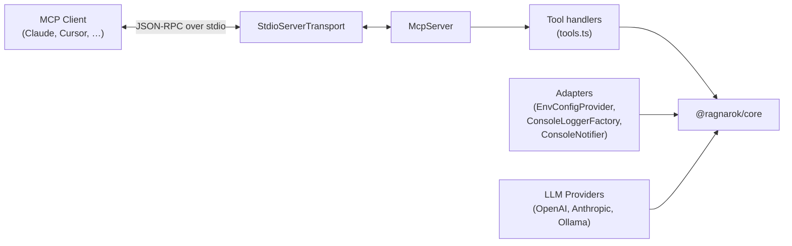

# @ragnarok/mcp-server

MCP server exposing RAGnarōk tools to any MCP-compatible agent — Claude Desktop,
Cursor, VS Code (via MCP client), CLI tools, and more.

---

## Architecture



---

## MCP Tools

The server registers 23 tools. HTTP reader sessions may invoke only read operations; stdio and HTTP writer sessions receive the complete surface.

| Tool                         | Description                                                                                          | Parameters                                                                                                                                                         |
| ---------------------------- | ---------------------------------------------------------------------------------------------------- | ------------------------------------------------------------------------------------------------------------------------------------------------------------------ |
| `rag_query`                  | Query a topic with RAG (supports agentic multi-step planning)                                        | `topic` (string), `query` (string), `topK?` (number), `retrievalStrategy?` (`"vector"` \| `"hybrid"` \| `"ensemble"` \| `"bm25"` \| `"graph"` \| `"graph_hybrid"`) |
| `rag_list_topics`            | List all available topics with metadata                                                              | _(none)_                                                                                                                                                           |
| `rag_topic_stats`            | Get statistics for a topic                                                                           | `topic` (string)                                                                                                                                                   |
| `rag_create_topic`           | Create a new topic                                                                                   | `name` (string), `description?` (string)                                                                                                                           |
| `rag_add_documents`          | Add documents to a topic (paths must be inside `RAGNAROK_ALLOWED_PATHS`)                             | `topic` (string), `filePaths` (string[])                                                                                                                           |
| `rag_list_embedding_models`  | List available embedding models                                                                      | _(none)_                                                                                                                                                           |
| `rag_embedding_info`         | Get current embedding model info                                                                     | _(none)_                                                                                                                                                           |
| `rag_switch_embedding_model` | Switch the active embedding model                                                                    | `model` (string)                                                                                                                                                   |
| `rag_llm_status`             | Get LLM provider status and configuration                                                            | _(none)_                                                                                                                                                           |
| `rag_list_reranker_models`   | List available cross-encoder reranker models                                                         | _(none)_                                                                                                                                                           |
| `rag_reranker_info`          | Get current reranker configuration and status                                                        | _(none)_                                                                                                                                                           |
| `rag_switch_reranker_model`  | Switch the cross-encoder reranker model                                                              | `model` (string)                                                                                                                                                   |
| `rag_memory`                 | Project memory: store, recall, forget (incl. `expired`), stats, list, decay, history, promote, links | `action` (string) plus action-specific fields (`content`, `query`, `id`, `scope`, `branch`, `tags`, `topK`, `olderThan`, `expired`, `limit`, `includeEntities`)    |
| `rag_list_documents`         | List a topic's indexed source documents                                                              | `topic` (string)                                                                                                                                                   |
| `rag_delete_topic`           | Delete a topic and all managed data                                                                  | `topic` (string), `confirm` (`true`)                                                                                                                               |
| `rag_remove_document`        | Remove one document, its chunks, and graph provenance                                                | `topic` (string), `documentId` (string), `confirm` (`true`)                                                                                                        |
| `rag_rename_topic`           | Rename a topic                                                                                       | `topic` (string), `newName` (string)                                                                                                                               |
| `rag_add_url`                | Securely ingest a public HTTP(S) URL                                                                 | `topic` (string), `url` (string)                                                                                                                                   |
| `rag_add_github_repo`        | Ingest an allowlisted GitHub/GHES repository                                                         | `topic` (string), `url` (string), `branch?` (string)                                                                                                               |
| `rag_export_topic`           | Export a checksummed storage-format-v2 `.rag` archive                                                | `topic` (string)                                                                                                                                                   |
| `rag_import_topic`           | Import a validated `.rag` archive from an allowlisted path                                           | `archivePath` (string), `confirm` (`true`)                                                                                                                         |
| `rag_reset_memory`           | Delete standalone memory after explicit confirmation                                                 | `confirm` (`true`)                                                                                                                                                 |
| `rag_storage_status`         | Report storage format, location, and reset requirements                                              | _(none)_                                                                                                                                                           |

---

## Module Layout

```
src/
├── index.ts         # Entry point — bootstraps adapters, MCP server, transport
├── config.ts        # McpConfig type & loadConfig() from environment variables
├── adapters.ts      # Console / env adapters for @ragnarok/core interfaces
├── httpServer.ts    # HTTP transport (Express + StreamableHTTPServerTransport)
├── llmProviders.ts  # OpenAI, Anthropic, Ollama LLM provider implementations
└── tools.ts         # Tool definitions & handlers (registerTools)
```

---

## Configuration

All settings are read from environment variables at startup:

| Variable                                 | Default                         | Description                                                                                                                       |
| ---------------------------------------- | ------------------------------- | --------------------------------------------------------------------------------------------------------------------------------- |
| `RAGNAROK_STORAGE_DIR`                   | `~/.ragnarok`                   | Database & topic storage directory                                                                                                |
| `RAGNAROK_WORKING_DIR`                   | `process.cwd()`                 | Project root for git-branch-scoped memory                                                                                         |
| `RAGNAROK_ALLOWED_PATHS`                 | _(the working dir)_             | Roots `rag_add_documents` may read, path-delimiter separated                                                                      |
| `RAGNAROK_LANGGRAPH_ENABLED`             | `false`                         | Run queries/indexing through the LangGraph pipeline (experimental)                                                                |
| `RAGNAROK_QUERY_MEMORY_ENABLED`          | `false`                         | Allow high-confidence query insights to be stored as reserved automatic memories                                                  |
| `RAGNAROK_EMBEDDING_MODEL`               | `Xenova/all-MiniLM-L6-v2`       | Embedding model name (HuggingFace or remote)                                                                                      |
| `RAGNAROK_EMBEDDING_PROVIDER`            | `huggingface`                   | Embedding provider: `huggingface`, `openai`, `ollama`                                                                             |
| `RAGNAROK_EMBEDDING_BASE_URL`            | _(empty)_                       | Remote embedding API base URL (required for openai/ollama)                                                                        |
| `RAGNAROK_EMBEDDING_API_KEY`             | _(empty)_                       | API key for remote embedding API                                                                                                  |
| `RAGNAROK_CHUNK_SIZE`                    | `1000`                          | Document chunk size (characters)                                                                                                  |
| `RAGNAROK_CHUNK_OVERLAP`                 | `200`                           | Overlap between chunks                                                                                                            |
| `RAGNAROK_TOP_K`                         | `10`                            | Default number of results per query                                                                                               |
| `RAGNAROK_RETRIEVAL_STRATEGY`            | `hybrid`                        | Default retrieval strategy                                                                                                        |
| `RAGNAROK_MAX_ITERATIONS`                | `3`                             | Max agentic refinement iterations                                                                                                 |
| `RAGNAROK_CONFIDENCE_THRESHOLD`          | `0.7`                           | Confidence threshold for early stopping                                                                                           |
| `RAGNAROK_LOG_LEVEL`                     | `info`                          | Log level (`debug`, `info`, `warn`, `error`)                                                                                      |
| `RAGNAROK_LLM_PROVIDER`                  | `none`                          | LLM provider: `openai`, `anthropic`, `ollama`, `none`                                                                             |
| `RAGNAROK_LLM_API_KEY`                   | _(empty)_                       | API key for OpenAI or Anthropic                                                                                                   |
| `RAGNAROK_LLM_MODEL`                     | _(per-provider)_                | LLM model name (e.g. `gpt-4o-mini`, `claude-sonnet-4-20250514`, `llama3`)                                                         |
| `RAGNAROK_LLM_BASE_URL`                  | _(per-provider)_                | LLM API base URL override (Ollama defaults to `http://localhost:11434`; OpenAI/Anthropic use their official endpoints unless set) |
| `RAGNAROK_RERANKER_MODEL`                | `Xenova/ms-marco-MiniLM-L-6-v2` | Cross-encoder reranker model                                                                                                      |
| `RAGNAROK_RERANKER_ENABLED`              | `true`                          | Enable bundled cross-encoder reranking                                                                                            |
| `RAGNAROK_RERANKER_MAX_CANDIDATES`       | `20`                            | Maximum candidates scored by the reranker                                                                                         |
| `RAGNAROK_RERANKER_CANDIDATE_MULTIPLIER` | `4`                             | First-stage over-fetch multiplier                                                                                                 |
| `RAGNAROK_API_KEY`                       | _(empty)_                       | HTTP read token; required for non-loopback binds                                                                                  |
| `RAGNAROK_WRITE_API_KEY`                 | _(empty)_                       | Distinct HTTP write token; omission makes authenticated HTTP read-only                                                            |
| `RAGNAROK_CORS_ORIGIN`                   | `*`                             | Allowed CORS origin(s)                                                                                                            |
| `RAGNAROK_HTTP_HOST`                     | `127.0.0.1`                     | HTTP server bind address (`0.0.0.0` for Docker)                                                                                   |
| `RAGNAROK_PORT`                          | `3000`                          | HTTP transport port (when `--http` is used)                                                                                       |
| `RAGNAROK_SESSION_IDLE_TTL_MS`           | `1800000`                       | HTTP session idle expiry                                                                                                          |
| `RAGNAROK_MAX_SESSIONS`                  | `100`                           | Maximum concurrent HTTP sessions                                                                                                  |
| `RAGNAROK_RATE_LIMIT_PER_MINUTE`         | `100`                           | Per-client HTTP request limit                                                                                                     |
| `RAGNAROK_EXPORT_DIR`                    | `<storage>/exports`             | Only directory used for exported archives                                                                                         |
| `RAGNAROK_GITHUB_HOSTS`                  | `github.com`                    | Comma-separated GitHub/GHES host allowlist                                                                                        |
| `RAGNAROK_GITHUB_TOKEN`                  | _(empty)_                       | GitHub credential; never accepted as a tool argument                                                                              |
| `RAGNAROK_CHECKPOINT_RETENTION_MS`       | `0`                             | Debug retention for successful checkpoints; zero cleans immediately                                                               |
| `RAGNAROK_RESET_STORAGE`                 | `false`                         | Set to `1` to back up managed data and initialize storage v2                                                                      |

---

## Adapters

The MCP server uses console / environment-based adapters instead of VS Code
APIs:

| Adapter                | Core Interface    | Implementation                                                                |
| ---------------------- | ----------------- | ----------------------------------------------------------------------------- |
| `EnvConfigProvider`    | `IConfigProvider` | Reads from `McpConfig` (environment variables)                                |
| `ConsoleLoggerFactory` | `ILoggerFactory`  | Logs to `console.log` / `console.error` with `[LEVEL] [context]` prefix       |
| `ConsoleNotifier`      | `INotifier`       | Prints notifications and progress to console                                  |
| `createLLMProvider()`  | `ILLMProvider`    | Factory — creates OpenAI, Anthropic, Ollama, or null provider based on config |

---

## Usage

### Running

```bash
# stdio mode (default) — for Claude Desktop, Cursor, VS Code MCP, etc.
# The package is scoped: npx must resolve @ragnarok/mcp-server (its bin is ragnarok-mcp)
npx -y @ragnarok/mcp-server

# or directly
node packages/mcp-server/dist/index.js
```

### HTTP Mode

```bash
# Start with HTTP transport
RAGNAROK_API_KEY=read-secret RAGNAROK_WRITE_API_KEY=write-secret npx -y @ragnarok/mcp-server --http

# Or with Docker
cd packages/mcp-server
docker compose up -d
```

The HTTP server exposes:

- `POST /mcp` — MCP JSON-RPC endpoint (supports SSE streaming)
- `GET /mcp` — SSE stream for server-initiated notifications
- `DELETE /mcp` — Close MCP session
- `GET /health` — Health check endpoint
- `GET /ready` — Readiness endpoint

**Authentication and roles:** `RAGNAROK_API_KEY` is the read token and `RAGNAROK_WRITE_API_KEY` is the distinct writer token. The token used during MCP initialization fixes the session role; subsequent requests must use the same token. Non-loopback binds require a read token and restricted CORS. Omitting the writer token intentionally exposes a read-only service. Loopback with neither token remains read/write for local development.

### Storage format v2

Fresh storage initializes `storage-format.json` automatically. A non-empty directory without the v2 marker fails closed; it is never interpreted optimistically. Start once with `--reset-storage` or `RAGNAROK_RESET_STORAGE=1` to move managed data into a timestamped backup and initialize v2. Existing branch-era storage and pre-2.0 archives are intentionally not migrated.

**Testing the connection:**

```bash
# Health check
curl http://localhost:3000/health

# MCP initialize handshake
curl -X POST http://localhost:3000/mcp \
  -H "Content-Type: application/json" \
  -H "Authorization: Bearer your-secret" \
  -d '{"jsonrpc":"2.0","method":"initialize","params":{"protocolVersion":"2025-03-26","capabilities":{},"clientInfo":{"name":"test","version":"0.1.0"}},"id":1}'
```

### Claude Desktop configuration

Add to your Claude Desktop `claude_desktop_config.json`:

```json
{
  "mcpServers": {
    "ragnarok": {
      "command": "npx",
      "args": ["-y", "@ragnarok/mcp-server"],
      "env": {
        "RAGNAROK_STORAGE_DIR": "/path/to/storage",
        "RAGNAROK_WORKING_DIR": "/path/to/your/project",
        "RAGNAROK_LOG_LEVEL": "info"
      }
    }
  }
}
```

### VS Code MCP client

Add to your VS Code `settings.json`:

```json
{
  "mcp": {
    "servers": {
      "ragnarok": {
        "command": "npx",
        "args": ["-y", "@ragnarok/mcp-server"]
      }
    }
  }
}
```

---

## Docker

### Quick Start

```bash
cd packages/mcp-server

# Build and run
docker compose up -d

# Check health (Compose exposes port 4000 by default)
curl http://localhost:4000/health

# View logs
docker compose logs -f

# Stop
docker compose down
```

### Configuration

Pass environment variables to configure the container:

```bash
# .env file (in packages/mcp-server/)
RAGNAROK_API_KEY=your-secret-key
RAGNAROK_WRITE_API_KEY=a-different-write-secret
RAGNAROK_LLM_PROVIDER=openai
RAGNAROK_LLM_API_KEY=sk-...
RAGNAROK_LLM_MODEL=gpt-4o-mini
RAGNAROK_CORS_ORIGIN=https://myapp.example.com
```

Data is persisted in a Docker volume (`ragnarok-data`). To use a host directory instead:

```yaml
# Override in docker-compose.override.yml
services:
  ragnarok-mcp:
    volumes:
      - ./data:/data/ragnarok
```
