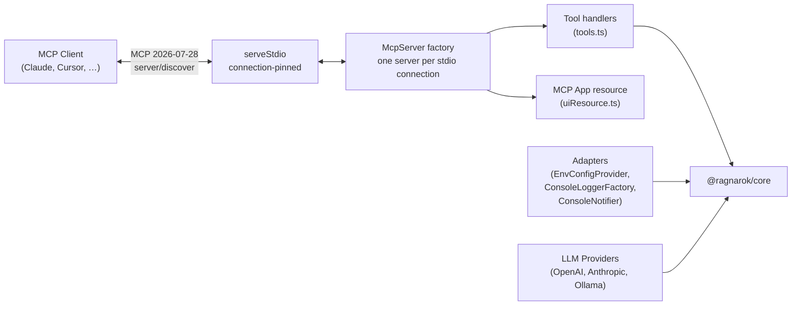

# @ragnarok/mcp-server

MCP server exposing RAGnarōk tools to any MCP-compatible agent — Claude Desktop,
Cursor, VS Code (via MCP client), CLI tools, and more.

RAGnarok 0.7.0 serves MCP protocol `2026-07-28` only. Clients must use
`server/discover` or modern version negotiation; legacy `initialize` is
rejected and there is no compatibility mode.

**Stdio is the only transport.** There is no HTTP mode, no listener, no
endpoint, and no bearer token. The server is a child process of one MCP client
on one machine, running as the user who spawned it. Environment variables that
configured the removed HTTP transport are rejected at startup — see
[MIGRATION.md](../../MIGRATION.md) for the complete list and how to migrate.

---

## Architecture



Logs go to stderr so they never corrupt the JSON-RPC framing on stdout.

---

## Tool surface

The server registers **24 tools**, unconditionally. There are no roles and no
capability tiers: the client already runs with the owner's authority, so a
second authorization model inside the process would protect nothing. Every tool
below appears in `tools/list` on every connection.

Destructive tools (`rag_delete_topic`, `rag_remove_document`,
`rag_reset_memory`, archive import) require an explicit `confirm: true`. That is
a guard against an agent's mistake, not an authorization boundary — see
[security](../../docs/SECURITY.md).

Document ingestion reads paths on the machine running the server, restricted to
canonical `security.allowedPaths` roots. There is no upload handle; place a
file where the server can read it.

## MCP Tools

| Tool                         | Description                                                                                                                               | Parameters                                                                                                                                                      |
| ---------------------------- | ----------------------------------------------------------------------------------------------------------------------------------------- | --------------------------------------------------------------------------------------------------------------------------------------------------------------- |
| `rag_query`                  | Query a topic with RAG (supports agentic multi-step planning)                                                                             | `topic` (string), `query` (string), `topK?` (number), `retrievalStrategy?` (`"vector"` \| `"hybrid"` \| `"bm25"`)                                               |
| `rag_list_topics`            | List all available topics with metadata                                                                                                   | _(none)_                                                                                                                                                        |
| `rag_topic_stats`            | Get statistics for a topic                                                                                                                | `topic` (string)                                                                                                                                                |
| `rag_create_topic`           | Create a new topic                                                                                                                        | `name` (string), `description?` (string)                                                                                                                        |
| `rag_add_documents`          | Add documents to a topic (paths must be inside `security.allowedPaths`)                                                                   | `topic` (string), `filePaths` (string[])                                                                                                                        |
| `rag_list_embedding_models`  | List available embedding models                                                                                                           | _(none)_                                                                                                                                                        |
| `rag_embedding_info`         | Get current embedding model info                                                                                                          | _(none)_                                                                                                                                                        |
| `rag_switch_embedding_model` | Switch the active embedding model                                                                                                         | `model` (string)                                                                                                                                                |
| `rag_llm_status`             | Get LLM provider status and configuration                                                                                                 | _(none)_                                                                                                                                                        |
| `rag_list_reranker_models`   | List available cross-encoder reranker models                                                                                              | _(none)_                                                                                                                                                        |
| `rag_reranker_info`          | Get current reranker configuration and status                                                                                             | _(none)_                                                                                                                                                        |
| `rag_switch_reranker_model`  | Switch the cross-encoder reranker model                                                                                                   | `model` (string)                                                                                                                                                |
| `rag_memory`                 | Project memory: store, recall, forget (incl. `expired`), stats, list, decay, history, promote, links, communities (needs an LLM provider) | `action` (string) plus action-specific fields (`content`, `query`, `id`, `scope`, `branch`, `tags`, `topK`, `olderThan`, `expired`, `limit`, `includeEntities`) |
| `rag_list_documents`         | List a topic's indexed source documents                                                                                                   | `topic` (string)                                                                                                                                                |
| `rag_delete_topic`           | Delete a topic and all managed data                                                                                                       | `topic` (string), `confirm` (`true`)                                                                                                                            |
| `rag_remove_document`        | Remove one document and its chunks                                                                                                        | `topic` (string), `documentId` (string), `confirm` (`true`)                                                                                                     |
| `rag_rename_topic`           | Rename a topic                                                                                                                            | `topic` (string), `newName` (string)                                                                                                                            |
| `rag_graph_visualize`        | Return a deterministic memory graph and associate the MCP App                                                                             | One exact input shape from [Memory graph visualization](#memory-graph-visualization)                                                                            |
| `rag_add_url`                | Securely ingest a public HTTP(S) URL                                                                                                      | `topic` (string), `url` (string)                                                                                                                                |
| `rag_add_github_repo`        | Ingest an allowlisted GitHub/GHES repository                                                                                              | `topic` (string), `url` (string), `branch?` (string)                                                                                                            |
| `rag_export_topic`           | Export a checksummed storage-format-v2 `.rag` archive                                                                                     | `topic` (string)                                                                                                                                                |
| `rag_import_topic`           | Import a validated `.rag` archive from an allowlisted path                                                                                | `archivePath` (string), `confirm` (`true`)                                                                                                                      |
| `rag_reset_memory`           | Delete standalone memory after explicit confirmation                                                                                      | `confirm` (`true`)                                                                                                                                              |
| `rag_storage_status`         | Report storage format, location, and reset requirements                                                                                   | _(none)_                                                                                                                                                        |

---

## Memory graph visualization

Graphs exist only in the memory subsystem. There is no document knowledge
graph, and `rag_graph_visualize` has no knowledge input.

The tool is registered on every connection and exports the local user's own
memory. It accepts exactly one of these discriminated inputs; fields from the
other branch of the union and other unknown fields are rejected:

```ts
{ source: "memory", memoryScope: "workspace", maxNodes?: number }
{ source: "memory", memoryScope: "branch", branch: string, maxNodes?: number }
```

`branch` is trimmed, must contain 1 through 255 characters, is required only for
branch memory, and identifies that exact stored branch graph; an absent branch
graph returns a successful empty document. Workspace memory uses the single
workspace scope. `maxNodes` defaults to 500 and accepts integers 1 through
2,000. Projection retains at most 10,000 edges, and final wrapped results remain
within the configured response limit (1 MiB by default).

The memory graph is built by memory entity extraction, which requires a
configured LLM provider. Without one, memories are still stored and recalled by
vector similarity, the graph stays empty, and every visualization is a
successful empty document.

The first published output schema is
`ragnarok.graph.visualization.v1`. The unpublished
`ragnarok.graph.layout.v1` schema was removed and is not accepted or emitted.
The deterministic document includes source identity, positioned nodes, edges,
groups, viewport bounds, original/retained counts, empty/truncated status, and
ordered truncation reasons. Clients without MCP Apps can consume the same
document from text or `structuredContent` as machine-readable JSON.

Results contain complete persisted non-vector details. Memory node attributes
include `description`, `scope`, optional `branch`, `confidence`, `strength`,
`createdAt`, `updatedAt`, `sourceMemoryIds`, and `metadata`. Edge attributes
include the corresponding persisted description, provenance, confidence,
scope/branch, and metadata fields. Arbitrary metadata can contain sensitive
memory content. Embedding vectors are always excluded.

A record too large to fit the response limit returns
`GRAPH_VISUALIZATION_RECORD_TOO_LARGE`; any other failure returns
`GRAPH_VISUALIZATION_FAILED`. Both are stable tool errors in text and structured
content, never fallback or fabricated graph data.

The tool advertises exactly this modern metadata:

```json
{ "ui": { "resourceUri": "ui://ragnarok/graph" } }
```

`resources/list` and `resources/read` use the exact MIME type
`text/html;profile=mcp-app`. The returned HTML is one self-contained,
network-free app with no external scripts. The app starts in a loading state,
renders explicit ready/empty/error states, and clears stale selection and panel
state for every result. Its SVG has an accessible name; graph items use roving
keyboard focus; arrow keys move focus; Enter or Space opens text-only details;
Escape or Close restores focus. Status and error regions are announced,
controls are touch-sized, and reset refits the viewport. A VS Code extension
webview remains deferred; current visualization delivery is the MCP App only.

---

## Module Layout

```
src/
├── index.ts         # Entry point — bootstraps adapters, MCP server, stdio transport
├── config.ts        # McpConfig type, loadConfig(), removed-variable rejection
├── configFile.ts    # <storageDir>/config.json — key table, schema, generation
├── adapters.ts      # Console / env adapters for @ragnarok/core interfaces
├── llmProviders.ts  # OpenAI, Anthropic, Ollama LLM provider implementations
├── uiResource.ts    # ui://ragnarok/graph MCP App resource
└── tools.ts         # Tool definitions & handlers (registerTools)
```

---

## Configuration

A setting is resolved from two places, in this order:

**`config.json` → built-in default**

`config.json` is the only way to set the 24 operational settings. Seven more —
three secrets, two bootstrap paths, two one-shot switches — are environment-only,
because a file inside the storage directory structurally cannot serve them. There
is no third path and no overlap: an environment variable named after one of the 24
is not read, so setting it does nothing.

Precedence is one-directional and there is no write-back: the file beats the
built-in default, and nothing the server reads is ever copied down into a lower
layer.

### `config.json`

The file lives at `<storageDir>/config.json` — beside `storage-format.json` in
the storage directory, so it travels with the store it configures. It is
**optional**: the server generates it on the first run that finds it absent,
and an absent file is never an error.

The generated file has no live settings in it at all. It carries a short
instruction, a `$defaults` block, and an `$envOnly` block:

```json
{
  "//": "Set a key below to override the default. Delete a key to return to the default.",
  "//env": "Secrets and bootstrap settings cannot be set here — see $envOnly.",
  "$defaults": {
    "embedding": { "provider": "huggingface", "model": "Xenova/all-MiniLM-L6-v2", "baseUrl": "" },
    "llm": { "provider": "none", "model": "", "baseUrl": "", "requestTimeoutMs": 30000 },
    "//": "abridged here — every section below has a row in the table"
  },
  "$envOnly": {
    "RAGNAROK_STORAGE_DIR": "bootstrap — this file's location derives from it",
    "//": "abridged here — all seven are listed below"
  }
}
```

To change a setting, add the key at the top level of the file, outside
`$defaults`:

```json
{
  "//": "Set a key below to override the default. Delete a key to return to the default.",
  "llm": { "provider": "ollama", "model": "llama3" },
  "retrieval": { "topK": 20 }
}
```

### Absence is the signal

**A key that is absent from the file uses the current built-in default.** It is
not pinned to the default that was current when the file was generated, so a
setting you never touched picks up an improved default when you upgrade. **A key
that is present pins your value**, and keeps it across every future release
until you delete the key. Deleting a key is how you return a setting to the
built-in default — there is no "unset" value.

`$defaults` is documentation, not configuration. It is **never** read as a
setting: it exists so that you can see the current defaults without consulting
the table below, and copy a line out of it when you want to pin one. The same is
true of `$envOnly`, and of any key whose name starts with `//`.

Settings are read before the file is generated or refreshed, so an edit — like
the first run's generation itself — takes effect on the next start. Restart the
server after changing the file.

Because `$defaults` and `$envOnly` are documentation, they must not go stale. On
every boot the server compares both blocks against the code and, if either has
drifted, rewrites them in place — preserving your live keys and your `//`
comments untouched. The rewrite goes through a temporary file and a rename, so
your settings survive a crash and a concurrently starting server never reads a
half-written file. Upgrading the server therefore refreshes the documentation in
your file without disturbing anything you set.

Generating the file and refreshing `$defaults` are conveniences and never fail
the server. If the storage directory is read-only — a mounted volume, or a
container run with `--read-only` — the two cases differ. When the file could not
be **created**, the server logs a warning to stderr and runs on the built-in
defaults. When the file exists but its `$defaults` block
could not be **refreshed**, the stale block is left exactly as it is, silently,
and every setting in the file still applies — only the documentation is out of
date. Neither case delays or prevents startup.

### What is a startup error

Everything below aborts startup with a message naming the file and the offending
key, rather than being ignored or guessed at:

| Condition                                        | Why it fails                                                                    |
| ------------------------------------------------ | ------------------------------------------------------------------------------- |
| An unknown key, or an unknown section            | A typo that was silently ignored would look exactly like a setting that worked  |
| A value of the wrong type, or out of range       | Same reason; the schema is derived from the same table the server reads         |
| Malformed JSON                                   | Half a file is not a configuration                                              |
| The file exists but cannot be read (`EACCES`, …) | An unreadable file is not an absent one; falling back would discard your intent |
| An environment-only setting written as a key     | Fails with the name of the environment variable to set instead                  |

An **absent** file is the one case that is not an error.

### Settings

Each key is a `section.name` pair to write in `config.json`. There is no
environment variable for any of them.

| `config.json` key               | Default                         | Description                                                                                                                       |
| ------------------------------- | ------------------------------- | --------------------------------------------------------------------------------------------------------------------------------- |
| `security.allowedPaths`         | _(the working dir)_             | Roots `rag_add_documents` may read, as a JSON array of strings                                                                    |
| `embedding.model`               | `Xenova/all-MiniLM-L6-v2`       | Default embedding model for newly created topics (HuggingFace or remote)                                                          |
| `embedding.provider`            | `huggingface`                   | Embedding provider: `huggingface`, `openai`, `ollama`                                                                             |
| `embedding.baseUrl`             | _(empty)_                       | Remote embedding API base URL (required for openai/ollama)                                                                        |
| `embedding.maxResidentModels`   | `2`                             | Maximum embedding models held in memory at once (minimum `1`)                                                                     |
| `ingestion.chunkSize`           | `1000`                          | Document chunk size (characters)                                                                                                  |
| `ingestion.chunkOverlap`        | `200`                           | Overlap between chunks                                                                                                            |
| `retrieval.topK`                | `10`                            | Default number of results per query                                                                                               |
| `retrieval.strategy`            | `hybrid`                        | Default retrieval strategy                                                                                                        |
| `retrieval.maxIterations`       | `3`                             | Max agentic refinement iterations                                                                                                 |
| `retrieval.confidenceThreshold` | `0.7`                           | Confidence threshold for early stopping                                                                                           |
| `logging.level`                 | `info`                          | Log level (`debug`, `info`, `warn`, `error`)                                                                                      |
| `llm.provider`                  | `none`                          | LLM provider: `openai`, `anthropic`, `ollama`, `none`                                                                             |
| `llm.model`                     | _(per-provider)_                | LLM model name (e.g. `gpt-4o-mini`, `claude-sonnet-4-20250514`, `llama3`)                                                         |
| `llm.baseUrl`                   | _(per-provider)_                | LLM API base URL override (Ollama defaults to `http://localhost:11434`; OpenAI/Anthropic use their official endpoints unless set) |
| `llm.requestTimeoutMs`          | `30000`                         | Timeout for one configured LLM request                                                                                            |
| `reranker.model`                | `Xenova/ms-marco-MiniLM-L-6-v2` | Cross-encoder reranker model                                                                                                      |
| `reranker.enabled`              | `true`                          | Enable bundled cross-encoder reranking (a JSON boolean)                                                                           |
| `reranker.maxCandidates`        | `20`                            | Maximum candidates scored by the reranker                                                                                         |
| `reranker.candidateMultiplier`  | `4`                             | First-stage over-fetch multiplier                                                                                                 |
| `limits.shutdownDrainMs`        | `10000`                         | Budget for draining in-flight tool calls on SIGINT/SIGTERM                                                                        |
| `limits.maxResponseBytes`       | `1048576`                       | Maximum serialized tool response size                                                                                             |
| `storage.exportDir`             | `<storage>/exports`             | Only directory used for exported archives                                                                                         |
| `security.githubHosts`          | `github.com`                    | GitHub/GHES host allowlist, as a JSON array of strings. Lower-cased, and must not be empty                                        |

Three of those rows deserve a paragraph each.

#### Which embedding model gets used

`embedding.model` is **the default model for newly
created topics**. It is not a global switch: each topic records the embedding
model and fingerprint it was indexed under, and is served with that recorded
model for the rest of its life. Changing this setting re-embeds nothing and
invalidates nothing.

| Operation                              | Model used                                                   |
| -------------------------------------- | ------------------------------------------------------------ |
| Create a new topic                     | the configured `embedding.model`, recorded into its metadata |
| Query any topic                        | that topic's recorded model                                  |
| Add documents to an existing topic     | that topic's recorded model                                  |
| Memory (`rag_memory` store and recall) | the currently configured model                               |

Reading the table row by row: a topic built under one model keeps answering
under that model even while a different one is configured, and adding documents
to it embeds the new chunks with the topic's own model — so the topic stays one
coherent embedding space. Memory is the exception, because it is not a topic and
carries no per-topic metadata: it always uses the currently configured model, and
it follows an explicit `rag_switch_embedding_model` call, which is why that tool
rejects a candidate whose dimension memory cannot serve.

Changing a topic's model is therefore a delete-and-recreate, not a setting.
`rag_switch_embedding_model` changes the default for topics created afterwards
and re-points memory; it does not migrate anything already indexed.

**A knowledge base built against a remote embedding endpoint is readable only by
a deployment configured with that same endpoint.** The model is resolved per
topic, but the endpoint never is: a topic that names a foreign endpoint is
**refused**, never substituted, because an endpoint carries credentials and a
topic must not choose one on the server's behalf — and an endpoint serving a
different model under a familiar name would silently poison results. Point the
deployment at the endpoint the topic was built against, or rebuild the topic. A
knowledge base meant to travel between machines should be built with the bundled
local model.

#### How many models stay in memory

`embedding.maxResidentModels` bounds how many
embedding models are held in memory at once. The default is **2** and the
minimum is **1**; a lower value is a startup error.

The cap counts **weight-bearing** models only. `remote` and `vscodeLM` backends
hold no weights — they are HTTP or host calls — so they never occupy a slot and
are never evicted to make room for anything. Only locally loaded models are
bounded, evicted least-recently-used first.

A resident model costs RAM, not CPU: an idle model consumes no cycles, so the
cap is a memory budget rather than a throughput setting. Raising it does not
make anything slower. Lowering it to `1` means alternating between two topics
with different models unloads and reloads a model on every switch — correct, but
with the load cost paid on each query.

#### The GitHub host allowlist

`security.githubHosts` must resolve to at least one
host. An explicitly empty array is rejected at startup rather than quietly
falling back to `github.com`: emptying a security allowlist is a deliberate
instruction, and silently restoring the default would grant back access that had
just been revoked.

### Environment-only settings

Seven settings cannot be written to `config.json`. Naming one as a key is a
startup error that tells you which variable to set instead, which is a better
failure than an unexplained "unknown key". The same list appears in the
generated file's `$envOnly` block.

| Variable                     | Why it stays in the environment                                          |
| ---------------------------- | ------------------------------------------------------------------------ |
| `RAGNAROK_STORAGE_DIR`       | bootstrap — this file's location derives from it                         |
| `RAGNAROK_WORKING_DIR`       | bootstrap                                                                |
| `RAGNAROK_LLM_API_KEY`       | secret                                                                   |
| `RAGNAROK_EMBEDDING_API_KEY` | secret                                                                   |
| `RAGNAROK_GITHUB_TOKEN`      | secret                                                                   |
| `RAGNAROK_RESET_STORAGE`     | one-shot; persisting it would reset storage on every launch              |
| `RAGNAROK_IGNORE_LOCK`       | one-shot; persisting it would disable the single-writer lock permanently |

The three secrets are the point of the split: `config.json` sits in the storage
directory, gets copied with backups, and is readable by anything that can read
the store. Credentials belong in the process environment, where the MCP client
that spawns the server owns them.

Between them the two tables are the complete surface: 24 keys in the file, 7
variables in the environment, nothing else. A variable named after one of the 24
is simply not read.

Variables belonging to the **removed HTTP transport** are the one exception, and
they are not merely ignored: `assertNoRemovedEnvVars()` aborts startup and names
every offender it finds, so a stale shared-service configuration fails loudly
instead of quietly becoming a local pipe. They are deliberately not listed here —
naming them in a configuration guide would read as documentation of a supported
setting, and the startup error already tells you which one you set.

The difference in treatment is deliberate: those variables implied a capability
the server no longer has — a listening port, TLS termination, bearer auth — and
believing you have a hardened network service when nothing is listening is
dangerous. The 24 imply a value, which simply moved into the file.

---

## Concurrent Access

RAGnarōk enforces a single-writer constraint per storage directory via a cross-process storage lock (`<storageDir>/.ragnarok.lock`). Only one process may access a storage directory at a time. A second process fails fast with an error message naming the holder's PID instead of silently corrupting data. If a holder crashes, the lock self-heals automatically via heartbeat staleness detection (default 5 minutes) so a new process can acquire it.

For advanced setups that serialize access externally and need to bypass the lock, set `RAGNAROK_IGNORE_LOCK=1`. This is unsafe with concurrent writers and should only be used when you have your own synchronization mechanism.

See [the architecture](../../ARCHITECTURE.md#storage) for the complete
concurrency and storage model.

---

## Adapters

The MCP server uses console / environment-based adapters instead of VS Code
APIs:

| Adapter                | Core Interface    | Implementation                                                                |
| ---------------------- | ----------------- | ----------------------------------------------------------------------------- |
| `EnvConfigProvider`    | `IConfigProvider` | Reads from the resolved `McpConfig` (environment, then `config.json`)         |
| `ConsoleLoggerFactory` | `ILoggerFactory`  | Logs to `console.log` / `console.error` with `[LEVEL] [context]` prefix       |
| `ConsoleNotifier`      | `INotifier`       | Prints notifications and progress to console                                  |
| `createLLMProvider()`  | `ILLMProvider`    | Factory — creates OpenAI, Anthropic, Ollama, or null provider based on config |

---

## Usage

### Running

The server is normally spawned by an MCP client (see the Claude Desktop and VS
Code entries below), not started by hand. To run it directly:

```bash
# The package is scoped: npx must resolve @ragnarok/mcp-server (its bin is ragnarok-mcp)
npx -y @ragnarok/mcp-server

# or directly
node packages/mcp-server/dist/index.js
```

It reads JSON-RPC from stdin and writes to stdout, so a bare invocation in a
terminal will look like it hangs — that is the transport waiting for a client.
There is no flag that starts a listener. Cacheable `server/discover`, list, and
resource-read results advertise `ttlMs=0` and `cacheScope=private`.

Shut down by closing stdin or sending SIGINT/SIGTERM; in-flight tool calls drain
within `limits.shutdownDrainMs` and the storage lease is released.

### Storage format v2

Fresh storage initializes `storage-format.json` automatically. A non-empty
directory without the v2 marker fails closed; it is never interpreted
optimistically. Migrate supported v0.3 local and flat shared/common stores
offline using the dry-run/apply workflow in [MIGRATION.md](../../MIGRATION.md).
Use `--reset-storage` or `RAGNAROK_RESET_STORAGE=1` only when intentionally
backing up and replacing unsupported/unwanted managed data. Pre-v2 archives
remain unsupported.

**Testing the connection:**

Pipe one framed request into the process and read the reply from stdout:

```bash
printf '%s\n' '{"jsonrpc":"2.0","id":1,"method":"server/discover","params":{"_meta":{"io.modelcontextprotocol/protocolVersion":"2026-07-28","io.modelcontextprotocol/clientInfo":{"name":"probe","version":"0.6.0"},"io.modelcontextprotocol/clientCapabilities":{}}}}' \
  | node packages/mcp-server/dist/index.js
```

A successful reply advertises protocol `2026-07-28`. Follow it with a
`tools/list` request on the same connection to see all 24 tools.

### Claude Desktop configuration

Add to your Claude Desktop `claude_desktop_config.json`:

```json
{
  "mcpServers": {
    "ragnarok": {
      "command": "npx",
      "args": ["-y", "@ragnarok/mcp-server"],
      "env": {
        "RAGNAROK_STORAGE_DIR": "/path/to/storage",
        "RAGNAROK_WORKING_DIR": "/path/to/your/project"
      }
    }
  }
}
```

Only the bootstrap paths and any secrets belong here — those are the whole
environment surface. Everything in the settings table lives in
`<storageDir>/config.json`, which keeps one copy of the configuration next to the
store rather than one per client entry, and takes effect for every client pointed
at that storage directory.

### VS Code MCP client

Add to your VS Code `settings.json`:

```json
{
  "mcp": {
    "servers": {
      "ragnarok": {
        "command": "npx",
        "args": ["-y", "@ragnarok/mcp-server"]
      }
    }
  }
}
```

---

## Docker

The image runs the same stdio server. It publishes no port and has no health
endpoint, because a stdio process has neither — the container is a child of the
MCP client, and `-i` keeps stdin open as the transport.

### Quick Start

```bash
# From the repository root
npm run docker:build

npm run docker:run
# equivalently:
docker run -i --rm --init --read-only --cap-drop ALL \
  --security-opt no-new-privileges --tmpfs /tmp:size=256m \
  -v ragnarok-data:/data/ragnarok ragnarok-mcp
```

There is no Compose file: `docker compose up -d` would detach the process from
the stdin it needs.

### Configuration

**A container is configured by the `config.json` on its data volume**, not with
`-e`. Only secrets are passed on the command line:

```bash
docker run -i --rm --init --read-only --cap-drop ALL \
  --security-opt no-new-privileges --tmpfs /tmp:size=256m \
  -v ragnarok-data:/data/ragnarok \
  -e RAGNAROK_LLM_API_KEY="$OPENAI_API_KEY" \
  ragnarok-mcp
```

The image already sets `RAGNAROK_STORAGE_DIR=/data/ragnarok`, so the server finds
`/data/ragnarok/config.json` on the mounted volume. Put the rest there:

```json
{
  "llm": { "provider": "openai", "model": "gpt-4o-mini" }
}
```

`--read-only` applies to the image's root filesystem, not to the mounted volume,
so the server can still generate and refresh the file there — and the settings
survive a `--rm` container because the volume does. Seed the file before the
first run with a throwaway container over the same volume if you do not want to
start once and edit:

```bash
echo '{"llm":{"provider":"openai","model":"gpt-4o-mini"}}' | docker run --rm -i \
  -v ragnarok-data:/data/ragnarok --entrypoint sh ragnarok-mcp \
  -c 'mkdir -p /data/ragnarok && cat > /data/ragnarok/config.json'
```

Never bake secrets into the image, into `config.json`, or into a committed client
configuration. Use a host directory (`-v /path/on/host:/data/ragnarok`) when the
store must be visible outside Docker.

### Wiring the container to an MCP client

```json
{
  "mcpServers": {
    "ragnarok": {
      "command": "docker",
      "args": [
        "run",
        "-i",
        "--rm",
        "--init",
        "--read-only",
        "--cap-drop",
        "ALL",
        "--security-opt",
        "no-new-privileges",
        "--tmpfs",
        "/tmp:size=256m",
        "-v",
        "ragnarok-data:/data/ragnarok",
        "ragnarok-mcp"
      ]
    }
  }
}
```

The image runs as a non-root user with a read-only root filesystem. Keep
storage and exports below `/data/ragnarok`. Do not mount the Docker socket or
broad host directories. See [operations](../../docs/OPERATIONS.md) and
[security](../../docs/SECURITY.md).
