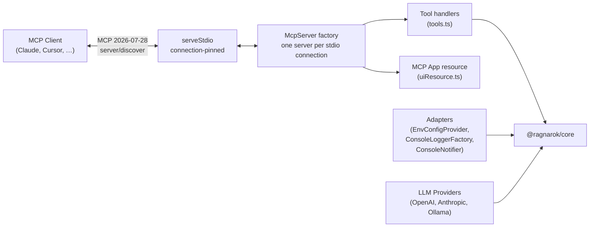

# @ragnarok/mcp-server

MCP server exposing RAGnarōk tools to any MCP-compatible agent — Claude Desktop,
Cursor, VS Code (via MCP client), CLI tools, and more.

RAGnarok 0.6.0 serves MCP protocol `2026-07-28` only. Clients must use
`server/discover` or modern version negotiation; legacy `initialize` is
rejected and there is no compatibility mode.

**Stdio is the only transport.** There is no HTTP mode, no listener, no
endpoint, and no bearer token. The server is a child process of one MCP client
on one machine, running as the user who spawned it. Environment variables that
configured the removed HTTP transport are rejected at startup — see
[MIGRATION.md](../../MIGRATION.md) for the complete list and how to migrate.

---

## Architecture



Logs go to stderr so they never corrupt the JSON-RPC framing on stdout.

---

## Tool surface

The server registers **24 tools**, unconditionally. There are no roles and no
capability tiers: the client already runs with the owner's authority, so a
second authorization model inside the process would protect nothing. Every tool
below appears in `tools/list` on every connection.

Destructive tools (`rag_delete_topic`, `rag_remove_document`,
`rag_reset_memory`, archive import) require an explicit `confirm: true`. That is
a guard against an agent's mistake, not an authorization boundary — see
[security](../../docs/SECURITY.md).

Document ingestion reads paths on the machine running the server, restricted to
canonical `RAGNAROK_ALLOWED_PATHS` roots. There is no upload handle; place a
file where the server can read it.

## MCP Tools

| Tool                         | Description                                                                                                                               | Parameters                                                                                                                                                      |
| ---------------------------- | ----------------------------------------------------------------------------------------------------------------------------------------- | --------------------------------------------------------------------------------------------------------------------------------------------------------------- |
| `rag_query`                  | Query a topic with RAG (supports agentic multi-step planning)                                                                             | `topic` (string), `query` (string), `topK?` (number), `retrievalStrategy?` (`"vector"` \| `"hybrid"` \| `"bm25"`)                                               |
| `rag_list_topics`            | List all available topics with metadata                                                                                                   | _(none)_                                                                                                                                                        |
| `rag_topic_stats`            | Get statistics for a topic                                                                                                                | `topic` (string)                                                                                                                                                |
| `rag_create_topic`           | Create a new topic                                                                                                                        | `name` (string), `description?` (string)                                                                                                                        |
| `rag_add_documents`          | Add documents to a topic (paths must be inside `RAGNAROK_ALLOWED_PATHS`)                                                                  | `topic` (string), `filePaths` (string[])                                                                                                                        |
| `rag_list_embedding_models`  | List available embedding models                                                                                                           | _(none)_                                                                                                                                                        |
| `rag_embedding_info`         | Get current embedding model info                                                                                                          | _(none)_                                                                                                                                                        |
| `rag_switch_embedding_model` | Switch the active embedding model                                                                                                         | `model` (string)                                                                                                                                                |
| `rag_llm_status`             | Get LLM provider status and configuration                                                                                                 | _(none)_                                                                                                                                                        |
| `rag_list_reranker_models`   | List available cross-encoder reranker models                                                                                              | _(none)_                                                                                                                                                        |
| `rag_reranker_info`          | Get current reranker configuration and status                                                                                             | _(none)_                                                                                                                                                        |
| `rag_switch_reranker_model`  | Switch the cross-encoder reranker model                                                                                                   | `model` (string)                                                                                                                                                |
| `rag_memory`                 | Project memory: store, recall, forget (incl. `expired`), stats, list, decay, history, promote, links, communities (needs an LLM provider) | `action` (string) plus action-specific fields (`content`, `query`, `id`, `scope`, `branch`, `tags`, `topK`, `olderThan`, `expired`, `limit`, `includeEntities`) |
| `rag_list_documents`         | List a topic's indexed source documents                                                                                                   | `topic` (string)                                                                                                                                                |
| `rag_delete_topic`           | Delete a topic and all managed data                                                                                                       | `topic` (string), `confirm` (`true`)                                                                                                                            |
| `rag_remove_document`        | Remove one document and its chunks                                                                                                        | `topic` (string), `documentId` (string), `confirm` (`true`)                                                                                                     |
| `rag_rename_topic`           | Rename a topic                                                                                                                            | `topic` (string), `newName` (string)                                                                                                                            |
| `rag_graph_visualize`        | Return a deterministic memory graph and associate the MCP App                                                                             | One exact input shape from [Memory graph visualization](#memory-graph-visualization)                                                                            |
| `rag_add_url`                | Securely ingest a public HTTP(S) URL                                                                                                      | `topic` (string), `url` (string)                                                                                                                                |
| `rag_add_github_repo`        | Ingest an allowlisted GitHub/GHES repository                                                                                              | `topic` (string), `url` (string), `branch?` (string)                                                                                                            |
| `rag_export_topic`           | Export a checksummed storage-format-v2 `.rag` archive                                                                                     | `topic` (string)                                                                                                                                                |
| `rag_import_topic`           | Import a validated `.rag` archive from an allowlisted path                                                                                | `archivePath` (string), `confirm` (`true`)                                                                                                                      |
| `rag_reset_memory`           | Delete standalone memory after explicit confirmation                                                                                      | `confirm` (`true`)                                                                                                                                              |
| `rag_storage_status`         | Report storage format, location, and reset requirements                                                                                   | _(none)_                                                                                                                                                        |

---

## Memory graph visualization

Graphs exist only in the memory subsystem. There is no document knowledge
graph, and `rag_graph_visualize` has no knowledge input.

The tool is registered on every connection and exports the local user's own
memory. It accepts exactly one of these discriminated inputs; fields from the
other branch of the union and other unknown fields are rejected:

```ts
{ source: "memory", memoryScope: "workspace", maxNodes?: number }
{ source: "memory", memoryScope: "branch", branch: string, maxNodes?: number }
```

`branch` is trimmed, must contain 1 through 255 characters, is required only for
branch memory, and identifies that exact stored branch graph; an absent branch
graph returns a successful empty document. Workspace memory uses the single
workspace scope. `maxNodes` defaults to 500 and accepts integers 1 through
2,000. Projection retains at most 10,000 edges, and final wrapped results remain
within the configured response limit (1 MiB by default).

The memory graph is built by memory entity extraction, which requires a
configured LLM provider. Without one, memories are still stored and recalled by
vector similarity, the graph stays empty, and every visualization is a
successful empty document.

The first published output schema is
`ragnarok.graph.visualization.v1`. The unpublished
`ragnarok.graph.layout.v1` schema was removed and is not accepted or emitted.
The deterministic document includes source identity, positioned nodes, edges,
groups, viewport bounds, original/retained counts, empty/truncated status, and
ordered truncation reasons. Clients without MCP Apps can consume the same
document from text or `structuredContent` as machine-readable JSON.

Results contain complete persisted non-vector details. Memory node attributes
include `description`, `scope`, optional `branch`, `confidence`, `strength`,
`createdAt`, `updatedAt`, `sourceMemoryIds`, and `metadata`. Edge attributes
include the corresponding persisted description, provenance, confidence,
scope/branch, and metadata fields. Arbitrary metadata can contain sensitive
memory content. Embedding vectors are always excluded.

A record too large to fit the response limit returns
`GRAPH_VISUALIZATION_RECORD_TOO_LARGE`; any other failure returns
`GRAPH_VISUALIZATION_FAILED`. Both are stable tool errors in text and structured
content, never fallback or fabricated graph data.

The tool advertises exactly this modern metadata:

```json
{ "ui": { "resourceUri": "ui://ragnarok/graph" } }
```

`resources/list` and `resources/read` use the exact MIME type
`text/html;profile=mcp-app`. The returned HTML is one self-contained,
network-free app with no external scripts. The app starts in a loading state,
renders explicit ready/empty/error states, and clears stale selection and panel
state for every result. Its SVG has an accessible name; graph items use roving
keyboard focus; arrow keys move focus; Enter or Space opens text-only details;
Escape or Close restores focus. Status and error regions are announced,
controls are touch-sized, and reset refits the viewport. A VS Code extension
webview remains deferred; current visualization delivery is the MCP App only.

---

## Module Layout

```
src/
├── index.ts         # Entry point — bootstraps adapters, MCP server, stdio transport
├── config.ts        # McpConfig type, loadConfig(), removed-variable rejection
├── adapters.ts      # Console / env adapters for @ragnarok/core interfaces
├── llmProviders.ts  # OpenAI, Anthropic, Ollama LLM provider implementations
├── uiResource.ts    # ui://ragnarok/graph MCP App resource
└── tools.ts         # Tool definitions & handlers (registerTools)
```

---

## Configuration

All settings are read from environment variables at startup:

| Variable                                 | Default                         | Description                                                                                                                                                        |
| ---------------------------------------- | ------------------------------- | ------------------------------------------------------------------------------------------------------------------------------------------------------------------ |
| `RAGNAROK_STORAGE_DIR`                   | `~/.ragnarok`                   | Database & topic storage directory                                                                                                                                 |
| `RAGNAROK_WORKING_DIR`                   | `process.cwd()`                 | Project root for git-branch-scoped memory                                                                                                                          |
| `RAGNAROK_ALLOWED_PATHS`                 | _(the working dir)_             | Roots `rag_add_documents` may read, path-delimiter separated                                                                                                       |
| `RAGNAROK_EMBEDDING_MODEL`               | `Xenova/all-MiniLM-L6-v2`       | Embedding model name (HuggingFace or remote)                                                                                                                       |
| `RAGNAROK_EMBEDDING_PROVIDER`            | `huggingface`                   | Embedding provider: `huggingface`, `openai`, `ollama`                                                                                                              |
| `RAGNAROK_EMBEDDING_BASE_URL`            | _(empty)_                       | Remote embedding API base URL (required for openai/ollama)                                                                                                         |
| `RAGNAROK_EMBEDDING_API_KEY`             | _(empty)_                       | API key for remote embedding API                                                                                                                                   |
| `RAGNAROK_CHUNK_SIZE`                    | `1000`                          | Document chunk size (characters)                                                                                                                                   |
| `RAGNAROK_CHUNK_OVERLAP`                 | `200`                           | Overlap between chunks                                                                                                                                             |
| `RAGNAROK_TOP_K`                         | `10`                            | Default number of results per query                                                                                                                                |
| `RAGNAROK_RETRIEVAL_STRATEGY`            | `hybrid`                        | Default retrieval strategy                                                                                                                                         |
| `RAGNAROK_MAX_ITERATIONS`                | `3`                             | Max agentic refinement iterations                                                                                                                                  |
| `RAGNAROK_CONFIDENCE_THRESHOLD`          | `0.7`                           | Confidence threshold for early stopping                                                                                                                            |
| `RAGNAROK_LOG_LEVEL`                     | `info`                          | Log level (`debug`, `info`, `warn`, `error`)                                                                                                                       |
| `RAGNAROK_LLM_PROVIDER`                  | `none`                          | LLM provider: `openai`, `anthropic`, `ollama`, `none`                                                                                                              |
| `RAGNAROK_LLM_API_KEY`                   | _(empty)_                       | API key for OpenAI or Anthropic                                                                                                                                    |
| `RAGNAROK_LLM_MODEL`                     | _(per-provider)_                | LLM model name (e.g. `gpt-4o-mini`, `claude-sonnet-4-20250514`, `llama3`)                                                                                          |
| `RAGNAROK_LLM_BASE_URL`                  | _(per-provider)_                | LLM API base URL override (Ollama defaults to `http://localhost:11434`; OpenAI/Anthropic use their official endpoints unless set)                                  |
| `RAGNAROK_RERANKER_MODEL`                | `Xenova/ms-marco-MiniLM-L-6-v2` | Cross-encoder reranker model                                                                                                                                       |
| `RAGNAROK_RERANKER_ENABLED`              | `true`                          | Enable bundled cross-encoder reranking                                                                                                                             |
| `RAGNAROK_RERANKER_MAX_CANDIDATES`       | `20`                            | Maximum candidates scored by the reranker                                                                                                                          |
| `RAGNAROK_RERANKER_CANDIDATE_MULTIPLIER` | `4`                             | First-stage over-fetch multiplier                                                                                                                                  |
| `RAGNAROK_SHUTDOWN_DRAIN_MS`             | `10000`                         | Budget for draining in-flight tool calls on SIGINT/SIGTERM                                                                                                         |
| `RAGNAROK_LLM_REQUEST_TIMEOUT_MS`        | `30000`                         | Timeout for one configured LLM request                                                                                                                             |
| `RAGNAROK_MAX_RESPONSE_BYTES`            | `1048576`                       | Maximum serialized tool response size                                                                                                                              |
| `RAGNAROK_EXPORT_DIR`                    | `<storage>/exports`             | Only directory used for exported archives                                                                                                                          |
| `RAGNAROK_GITHUB_HOSTS`                  | `github.com`                    | Comma-separated GitHub/GHES host allowlist                                                                                                                         |
| `RAGNAROK_GITHUB_TOKEN`                  | _(empty)_                       | GitHub credential; never accepted as a tool argument                                                                                                               |
| `RAGNAROK_RESET_STORAGE`                 | `false`                         | Set to `1` to back up managed data and initialize storage v2                                                                                                       |
| `RAGNAROK_IGNORE_LOCK`                   | unset                           | Bypass the cross-process storage lock (`<storageDir>/.ragnarok.lock`). Unsafe with concurrent writers — only for advanced setups that serialize access externally. |

`GITHUB_ACCESS_TOKEN` is accepted as a fallback for `RAGNAROK_GITHUB_TOKEN`.

That table is the complete surface. Variables belonging to the removed HTTP
transport are not merely ignored — `assertNoRemovedEnvVars()` aborts startup and
names every offender, so a stale shared-service configuration fails loudly
instead of quietly becoming a local pipe. See
[MIGRATION.md](../../MIGRATION.md) for the list and the one variable that is
silently ignored instead.

---

## Concurrent Access

RAGnarōk enforces a single-writer constraint per storage directory via a cross-process storage lock (`<storageDir>/.ragnarok.lock`). Only one process may access a storage directory at a time. A second process fails fast with an error message naming the holder's PID instead of silently corrupting data. If a holder crashes, the lock self-heals automatically via heartbeat staleness detection (default 5 minutes) so a new process can acquire it.

For advanced setups that serialize access externally and need to bypass the lock, set `RAGNAROK_IGNORE_LOCK=1`. This is unsafe with concurrent writers and should only be used when you have your own synchronization mechanism.

See [the architecture](../../ARCHITECTURE.md#storage) for the complete
concurrency and storage model.

---

## Adapters

The MCP server uses console / environment-based adapters instead of VS Code
APIs:

| Adapter                | Core Interface    | Implementation                                                                |
| ---------------------- | ----------------- | ----------------------------------------------------------------------------- |
| `EnvConfigProvider`    | `IConfigProvider` | Reads from `McpConfig` (environment variables)                                |
| `ConsoleLoggerFactory` | `ILoggerFactory`  | Logs to `console.log` / `console.error` with `[LEVEL] [context]` prefix       |
| `ConsoleNotifier`      | `INotifier`       | Prints notifications and progress to console                                  |
| `createLLMProvider()`  | `ILLMProvider`    | Factory — creates OpenAI, Anthropic, Ollama, or null provider based on config |

---

## Usage

### Running

The server is normally spawned by an MCP client (see the Claude Desktop and VS
Code entries below), not started by hand. To run it directly:

```bash
# The package is scoped: npx must resolve @ragnarok/mcp-server (its bin is ragnarok-mcp)
npx -y @ragnarok/mcp-server

# or directly
node packages/mcp-server/dist/index.js
```

It reads JSON-RPC from stdin and writes to stdout, so a bare invocation in a
terminal will look like it hangs — that is the transport waiting for a client.
There is no flag that starts a listener. Cacheable `server/discover`, list, and
resource-read results advertise `ttlMs=0` and `cacheScope=private`.

Shut down by closing stdin or sending SIGINT/SIGTERM; in-flight tool calls drain
within `RAGNAROK_SHUTDOWN_DRAIN_MS` and the storage lease is released.

### Storage format v2

Fresh storage initializes `storage-format.json` automatically. A non-empty
directory without the v2 marker fails closed; it is never interpreted
optimistically. Migrate supported v0.3 local and flat shared/common stores
offline using the dry-run/apply workflow in [MIGRATION.md](../../MIGRATION.md).
Use `--reset-storage` or `RAGNAROK_RESET_STORAGE=1` only when intentionally
backing up and replacing unsupported/unwanted managed data. Pre-v2 archives
remain unsupported.

**Testing the connection:**

Pipe one framed request into the process and read the reply from stdout:

```bash
printf '%s\n' '{"jsonrpc":"2.0","id":1,"method":"server/discover","params":{"_meta":{"io.modelcontextprotocol/protocolVersion":"2026-07-28","io.modelcontextprotocol/clientInfo":{"name":"probe","version":"0.6.0"},"io.modelcontextprotocol/clientCapabilities":{}}}}' \
  | node packages/mcp-server/dist/index.js
```

A successful reply advertises protocol `2026-07-28`. Follow it with a
`tools/list` request on the same connection to see all 24 tools.

### Claude Desktop configuration

Add to your Claude Desktop `claude_desktop_config.json`:

```json
{
  "mcpServers": {
    "ragnarok": {
      "command": "npx",
      "args": ["-y", "@ragnarok/mcp-server"],
      "env": {
        "RAGNAROK_STORAGE_DIR": "/path/to/storage",
        "RAGNAROK_WORKING_DIR": "/path/to/your/project",
        "RAGNAROK_LOG_LEVEL": "info"
      }
    }
  }
}
```

### VS Code MCP client

Add to your VS Code `settings.json`:

```json
{
  "mcp": {
    "servers": {
      "ragnarok": {
        "command": "npx",
        "args": ["-y", "@ragnarok/mcp-server"]
      }
    }
  }
}
```

---

## Docker

The image runs the same stdio server. It publishes no port and has no health
endpoint, because a stdio process has neither — the container is a child of the
MCP client, and `-i` keeps stdin open as the transport.

### Quick Start

```bash
# From the repository root
npm run docker:build

npm run docker:run
# equivalently:
docker run -i --rm --init --read-only --cap-drop ALL \
  --security-opt no-new-privileges --tmpfs /tmp:size=256m \
  -v ragnarok-data:/data/ragnarok ragnarok-mcp
```

There is no Compose file: `docker compose up -d` would detach the process from
the stdin it needs.

### Configuration

Pass configuration with `-e`, and point storage at the mounted volume:

```bash
docker run -i --rm --init --read-only --cap-drop ALL \
  --security-opt no-new-privileges --tmpfs /tmp:size=256m \
  -v ragnarok-data:/data/ragnarok \
  -e RAGNAROK_STORAGE_DIR=/data/ragnarok \
  -e RAGNAROK_LLM_PROVIDER=openai \
  -e RAGNAROK_LLM_API_KEY="$OPENAI_API_KEY" \
  -e RAGNAROK_LLM_MODEL=gpt-4o-mini \
  ragnarok-mcp
```

Never bake secrets into the image or a committed client configuration. Use a
host directory (`-v /path/on/host:/data/ragnarok`) when the store must be
visible outside Docker.

### Wiring the container to an MCP client

```json
{
  "mcpServers": {
    "ragnarok": {
      "command": "docker",
      "args": [
        "run",
        "-i",
        "--rm",
        "--init",
        "--read-only",
        "--cap-drop",
        "ALL",
        "--security-opt",
        "no-new-privileges",
        "--tmpfs",
        "/tmp:size=256m",
        "-v",
        "ragnarok-data:/data/ragnarok",
        "ragnarok-mcp"
      ]
    }
  }
}
```

The image runs as a non-root user with a read-only root filesystem. Keep
storage and exports below `/data/ragnarok`. Do not mount the Docker socket or
broad host directories. See [operations](../../docs/OPERATIONS.md) and
[security](../../docs/SECURITY.md).
