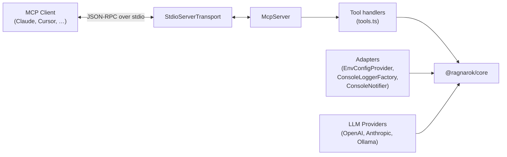

# @ragnarok/mcp-server

MCP server exposing RAGnarōk tools to any MCP-compatible agent — Claude Desktop,
Cursor, VS Code (via MCP client), CLI tools, and more.

---

## Architecture



---

## MCP Tools

The server registers nine tools:

| Tool                | Description                                                   | Parameters                                                                                                                        |
| ------------------- | ------------------------------------------------------------- | --------------------------------------------------------------------------------------------------------------------------------- |
| `rag_query`         | Query a topic with RAG (supports agentic multi-step planning) | `topic` (string), `query` (string), `topK?` (number), `retrievalStrategy?` (`"vector"` \| `"hybrid"` \| `"ensemble"` \| `"bm25"`) |
| `rag_list_topics`   | List all available topics with metadata                       | _(none)_                                                                                                                          |
| `rag_topic_stats`   | Get statistics for a topic                                    | `topic` (string)                                                                                                                  |
| `rag_create_topic`  | Create a new topic                                            | `name` (string), `description?` (string)                                                                                          |
| `rag_add_documents` | Add documents to a topic                                      | `topic` (string), `filePaths` (string[])                                                                                          |
| `rag_list_embedding_models` | List available embedding models                      | _(none)_                                                                                                                          |
| `rag_embedding_info` | Get current embedding model info                              | _(none)_                                                                                                                          |
| `rag_switch_embedding_model` | Switch the active embedding model                   | `model` (string)                                                                                                                  |
| `rag_llm_status`     | Get LLM provider status and configuration                     | _(none)_                                                                                                                          |

---

## Module Layout

```
src/
├── index.ts         # Entry point — bootstraps adapters, MCP server, transport
├── config.ts        # McpConfig type & loadConfig() from environment variables
├── adapters.ts      # Console / env adapters for @ragnarok/core interfaces
├── httpServer.ts    # HTTP transport (Express + StreamableHTTPServerTransport)
├── llmProviders.ts  # OpenAI, Anthropic, Ollama LLM provider implementations
└── tools.ts         # Tool definitions & handlers (registerTools)
```

---

## Configuration

All settings are read from environment variables at startup:

| Variable                        | Default                   | Description                                  |
| ------------------------------- | ------------------------- | -------------------------------------------- |
| `RAGNAROK_STORAGE_DIR`          | `~/.ragnarok`             | Database & topic storage directory           |
| `RAGNAROK_EMBEDDING_MODEL`      | `Xenova/all-MiniLM-L6-v2` | Embedding model name (HuggingFace or remote)  |
| `RAGNAROK_EMBEDDING_PROVIDER`   | `huggingface`             | Embedding provider: `huggingface`, `openai`, `ollama` |
| `RAGNAROK_EMBEDDING_BASE_URL`   | _(empty)_                 | Remote embedding API base URL (required for openai/ollama) |
| `RAGNAROK_EMBEDDING_API_KEY`    | _(empty)_                 | API key for remote embedding API              |
| `RAGNAROK_CHUNK_SIZE`           | `1000`                    | Document chunk size (characters)             |
| `RAGNAROK_CHUNK_OVERLAP`        | `200`                     | Overlap between chunks                       |
| `RAGNAROK_TOP_K`                | `5`                       | Default number of results per query          |
| `RAGNAROK_RETRIEVAL_STRATEGY`   | `hybrid`                  | Default retrieval strategy                   |
| `RAGNAROK_MAX_ITERATIONS`       | `3`                       | Max agentic refinement iterations            |
| `RAGNAROK_CONFIDENCE_THRESHOLD` | `0.7`                     | Confidence threshold for early stopping      |
| `RAGNAROK_LOG_LEVEL`            | `info`                    | Log level (`debug`, `info`, `warn`, `error`) |
| `RAGNAROK_LLM_PROVIDER`         | `none`                    | LLM provider: `openai`, `anthropic`, `ollama`, `none` |
| `RAGNAROK_LLM_API_KEY`          | _(empty)_                 | API key for OpenAI or Anthropic              |
| `RAGNAROK_LLM_MODEL`            | _(per-provider)_          | LLM model name (e.g. `gpt-4o-mini`, `claude-sonnet-4-20250514`, `llama3`) |
| `RAGNAROK_LLM_BASE_URL`         | `http://localhost:11434`  | Base URL for Ollama (or OpenAI-compatible)   |
| `RAGNAROK_API_KEY`              | _(empty)_                 | API key for HTTP auth (`Authorization: Bearer <key>`) |
| `RAGNAROK_CORS_ORIGIN`         | `*`                       | Allowed CORS origin(s)                       |
| `RAGNAROK_HTTP_HOST`           | `127.0.0.1`               | HTTP server bind address (`0.0.0.0` for Docker) |
| `RAGNAROK_PORT`                 | `3000`                    | HTTP transport port (when `--http` is used)  |

---

## Adapters

The MCP server uses console / environment-based adapters instead of VS Code
APIs:

| Adapter                | Core Interface    | Implementation                                                          |
| ---------------------- | ----------------- | ----------------------------------------------------------------------- |
| `EnvConfigProvider`    | `IConfigProvider` | Reads from `McpConfig` (environment variables)                          |
| `ConsoleLoggerFactory` | `ILoggerFactory`  | Logs to `console.log` / `console.error` with `[LEVEL] [context]` prefix |
| `ConsoleNotifier`      | `INotifier`       | Prints notifications and progress to console                            |
| `createLLMProvider()`  | `ILLMProvider`    | Factory — creates OpenAI, Anthropic, Ollama, or null provider based on config |

---

## Usage

### Running

```bash
# stdio mode (default) — for Claude Desktop, Cursor, VS Code MCP, etc.
npx ragnarok-mcp

# or directly
node packages/mcp-server/dist/index.js
```

### HTTP Mode

```bash
# Start with HTTP transport
RAGNAROK_API_KEY=your-secret npx ragnarok-mcp --http

# Or with Docker
cd packages/mcp-server
docker compose up -d
```

The HTTP server exposes:
- `POST /mcp` — MCP JSON-RPC endpoint (supports SSE streaming)
- `GET /mcp` — SSE stream for server-initiated notifications
- `DELETE /mcp` — Close MCP session
- `GET /health` — Health check endpoint

**Authentication:** Set `RAGNAROK_API_KEY` to require `Authorization: Bearer <key>` on `/mcp` requests. When unset, no authentication is applied.

**Testing the connection:**
```bash
# Health check
curl http://localhost:3000/health

# MCP initialize handshake
curl -X POST http://localhost:3000/mcp \
  -H "Content-Type: application/json" \
  -H "Authorization: Bearer your-secret" \
  -d '{"jsonrpc":"2.0","method":"initialize","params":{"protocolVersion":"2025-03-26","capabilities":{},"clientInfo":{"name":"test","version":"0.1.0"}},"id":1}'
```

### Claude Desktop configuration

Add to your Claude Desktop `claude_desktop_config.json`:

```json
{
  "mcpServers": {
    "ragnarok": {
      "command": "npx",
      "args": ["ragnarok-mcp"],
      "env": {
        "RAGNAROK_STORAGE_DIR": "/path/to/storage",
        "RAGNAROK_LOG_LEVEL": "info"
      }
    }
  }
}
```

### VS Code MCP client

Add to your VS Code `settings.json`:

```json
{
  "mcp": {
    "servers": {
      "ragnarok": {
        "command": "npx",
        "args": ["ragnarok-mcp"]
      }
    }
  }
}
```

---

## Docker

### Quick Start

```bash
cd packages/mcp-server

# Build and run
docker compose up -d

# Check health
curl http://localhost:3000/health

# View logs
docker compose logs -f

# Stop
docker compose down
```

### Configuration

Pass environment variables to configure the container:

```bash
# .env file (in packages/mcp-server/)
RAGNAROK_API_KEY=your-secret-key
RAGNAROK_LLM_PROVIDER=openai
RAGNAROK_LLM_API_KEY=sk-...
RAGNAROK_LLM_MODEL=gpt-4o-mini
RAGNAROK_CORS_ORIGIN=https://myapp.example.com
```

Data is persisted in a Docker volume (`ragnarok-data`). To use a host directory instead:

```yaml
# Override in docker-compose.override.yml
services:
  ragnarok-mcp:
    volumes:
      - ./data:/data/ragnarok
```
