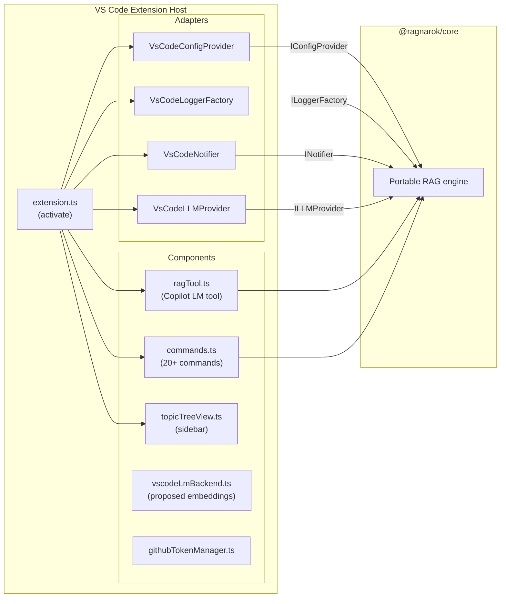

# @ragnarok/vscode

VS Code extension for RAGnarōk. Wires `@ragnarok/core` to VS Code APIs via
thin adapter classes, providing a full RAG-powered Copilot tool, sidebar UI,
and command palette integration.

The extension requires VS Code 1.105 or newer. The optional
`vscode.lm.computeEmbeddings` integration is a proposed API and additionally
requires a compatible VS Code build, explicit proposed-API enablement, and a
registered provider. The local HuggingFace backend remains the supported
fallback.

Release VSIX files are built for Linux, macOS, and Windows on x64 and arm64.
Each exact VSIX must pass install/activation/native-load smoke testing on its
target; see the repository [release procedure](../../docs/RELEASE.md).

---

## Architecture



---

## Module Layout

```
src/
├── extension.ts            # Activation entry point — creates adapters, wires core
├── index.ts                # Barrel export
├── constants.ts            # Commands, views, context keys (extends core constants)
├── ragTool.ts              # Copilot LM tool (ragQuery), per-topic RAGAgent cache
├── commands.ts             # 20+ VS Code commands
├── topicTreeView.ts        # Topics & config sidebar tree view providers
├── vscodeLmBackend.ts      # Proposed vscode.lm.computeEmbeddings backend
├── githubTokenManager.ts   # GitHub PAT management via SecretStorage
├── workspaceContext.ts      # Workspace file discovery for context enrichment
│
└── adapters/
    ├── index.ts
    ├── vsCodeConfigProvider.ts   # IConfigProvider → vscode.workspace.getConfiguration
    ├── vsCodeLogger.ts           # ILoggerFactory → vscode.window.createOutputChannel
    ├── vsCodeNotifier.ts         # INotifier → vscode.window.show*Message / withProgress
    └── vsCodeLLMProvider.ts      # ILLMProvider → vscode.lm.selectChatModels
```

---

## Adapters

Each adapter maps one `@ragnarok/core` interface to the corresponding VS Code
API, keeping the core completely decoupled from the extension host.

| Adapter                                | Core Interface               | VS Code API                                                          |
| -------------------------------------- | ---------------------------- | -------------------------------------------------------------------- |
| `VsCodeConfigProvider`                 | `IConfigProvider`            | `vscode.workspace.getConfiguration("ragnarok")`                      |
| `VsCodeLoggerFactory` / `VsCodeLogger` | `ILoggerFactory` / `ILogger` | `vscode.window.createOutputChannel("RAGnarōk")`                      |
| `VsCodeNotifier`                       | `INotifier`                  | `vscode.window.show{Info,Warning,Error}Message()` + `withProgress()` |
| `VsCodeLLMProvider`                    | `ILLMProvider`               | `vscode.lm.selectChatModels()`                                       |

---

## Key Components

### `extension.ts`

Activation entry point. Creates all adapters, initialises the
`EmbeddingService` and `TopicManager`, registers commands, tree views, and the
Copilot LM tool. Installs the VS Code logger factory with `setLoggerFactory()`
before any other code runs.

### `ragTool.ts`

Registers a Copilot Language Model tool (`ragQuery`) via `vscode.lm.registerTool`.
Maintains an LRU cache of up to 10 `RAGAgent` instances (one per topic) to
avoid re-initialising vector stores on every invocation.

### `commands.ts`

Registers 20+ commands under the `ragnarok.*` namespace. Grouped by function:

| Category            | Commands                                                                                       |
| ------------------- | ---------------------------------------------------------------------------------------------- |
| **Topics**          | `createTopic`, `deleteTopic`, `renameTopic`, `refreshTopics`                                   |
| **Documents**       | `addDocument`, `addGithubRepo`, `addWebUrl`                                                    |
| **Import / Export** | `exportTopic`, `importTopic`                                                                   |
| **Embedding**       | `setEmbeddingModel`, `selectHfEmbeddingModel`, `selectVscodeEmbeddingModel`, `clearModelCache` |
| **Configuration**   | `editConfigItem`, `selectLLMModel`                                                             |
| **GitHub tokens**   | `addGithubToken`, `listGithubTokens`, `removeGithubToken`                                      |
| **Maintenance**     | `clearDatabase`                                                                                |

### `topicTreeView.ts`

Provides two sidebar tree views:

- **Topics** (`ragTopics`) — topic list with document counts, expand to see
  documents.
- **Configuration** (`ragConfig`) — live settings display (embedding model,
  retrieval strategy, chunk size, etc.).

### `vscodeLmBackend.ts`

An `EmbeddingBackend` implementation using the **proposed** `vscode.lm.computeEmbeddings`
API. Falls back to the HuggingFace backend when the proposed API is unavailable.

### `githubTokenManager.ts`

Manages GitHub personal access tokens via `vscode.SecretStorage`. Tokens are
used by the GitHub document loader for authenticated repository ingestion.
